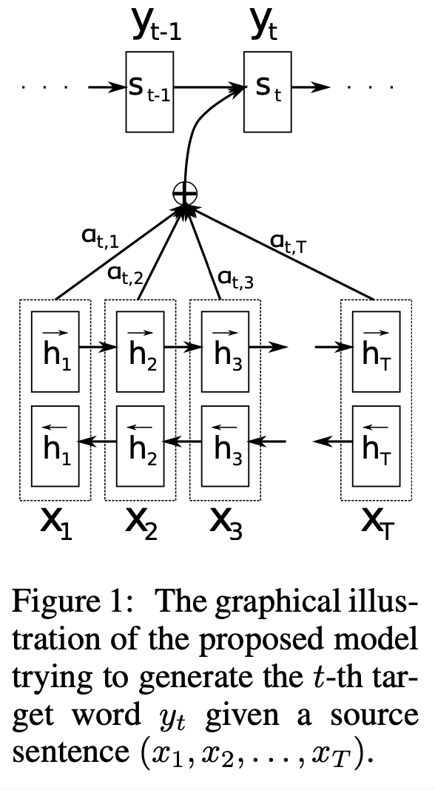
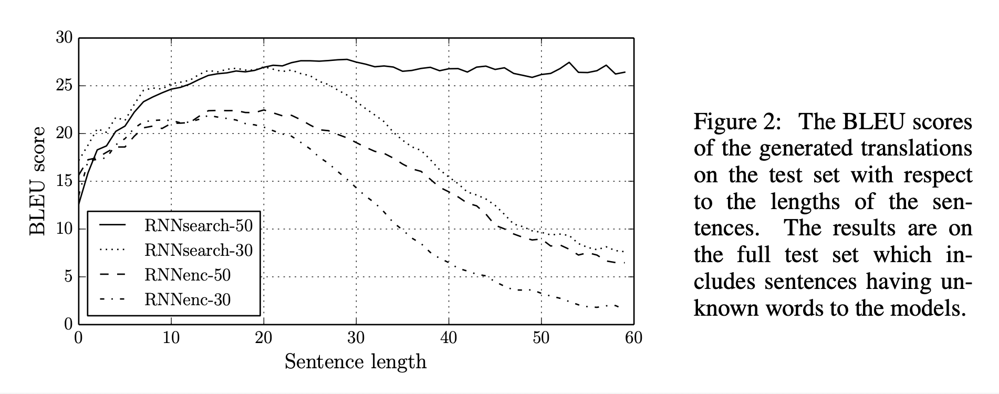
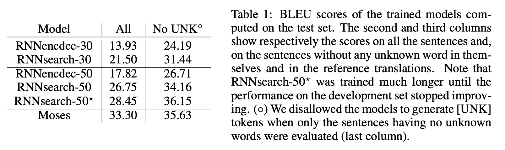

# Neural Machine Translation by Jointly Learning to Align and Translate (2016), D. Bahdanau et al.

###### contributors: [@GitYCC](https://github.com/GitYCC)

\[[paper](https://arxiv.org/abs/1409.0473)\] \[[pytorch](https://github.com/bentrevett/pytorch-seq2seq/blob/master/3%20-%20Neural%20Machine%20Translation%20by%20Jointly%20Learning%20to%20Align%20and%20Translate.ipynb)\]

---

### Prerequisite

**Sequence to Sequence Learning with Neural Networks** (2014), I. Sutskever et al. \[➤ [summary](nlp/sequence-to-sequence-learning-with-neural-networks.md)\]

### Model

- In this paper, we conjecture that the use of a fixed-length vector is a bottleneck in improving the performance of this basic encoder–decoder architecture, and propose to extend this by allowing a model to automatically (soft-)search for parts of a source sentence that are relevant to predicting a target word, without having to form these parts as a hard segment explicitly.
  - A potential issue with previous encoder–decoder approach is that a neural network needs to be able to compress all the necessary information of a source sentence into a fixed-length vector.
  - In order to address this issue, we introduce an extension to the encoder–decoder model which learns to align and translate jointly. Each time the proposed model generates a word in a translation, it (soft-)searches for a set of positions in a source sentence where the most relevant information is concentrated. The model then predicts a target word based on the context vectors associated with these source positions and all the previous generated target words.
- Seq2Seq Encoder-decoder Framework
  - target: translate from $\bold{x}$ to $\bold{y}$
  - encoder:
    - encoder RNN with hidden state: $h_t=f(x_t,h_{t-1})$
  - decoder:
    - $c=q(\{h_1,h_2,\dots,h_T\})$
    - the joint probability: $p(\bold{y})=\prod_{t}p(y_t\mid \{h_1,\dots,h_{t-1}\},c)$
      - with RNN: $p(y_t\mid \{h_1,\dots,h_{t-1}\},c)=g(y_{t-1},s_t,c)$
  - approach form "Sequence to Sequence Learning with Neural Networks"
    - $f$ and $g$ are LSTMs
    - $q(\{h_1,h_2,\dots,h_T\})=h_T$

- Our approach
  - 
  - $f$ is bi-directional LSTM
  - $p(y_i\mid \{h_1,\dots,h_{i-1}\},\bold{x})=g(y_{i-1},s_i,c_i)$
    - $g$ is LSTM
    - $c_i=\sum_j\alpha_{ij}h_j$
    - attention weight: $\alpha_{ij}=\frac{e_{ij}}{\sum_k e_{ik}}$
    - where: $e_{ij}=a(s_{i-1},h_j)$ : We parametrize the alignment model $a$ as a feedforward neural network which is jointly trained with all the other components of the proposed system.
    - Intuitively, this implements a mechanism of attention in the decoder. The decoder decides parts of the source sentence to pay attention to.

### Result

- We train two types of models. The first one is an RNN Encoder–Decoder (RNNencdec, Cho et al., 2014a), and the other is the proposed model, to which we refer as RNNsearch. We train each model twice: first with the sentences of length up to 30 words (RNNencdec-30, RNNsearch-30) and then with the sentences of length up to 50 word (RNNencdec-50, RNNsearch-50).

