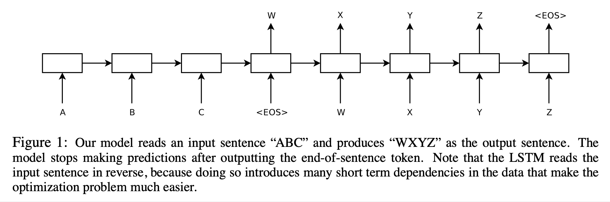
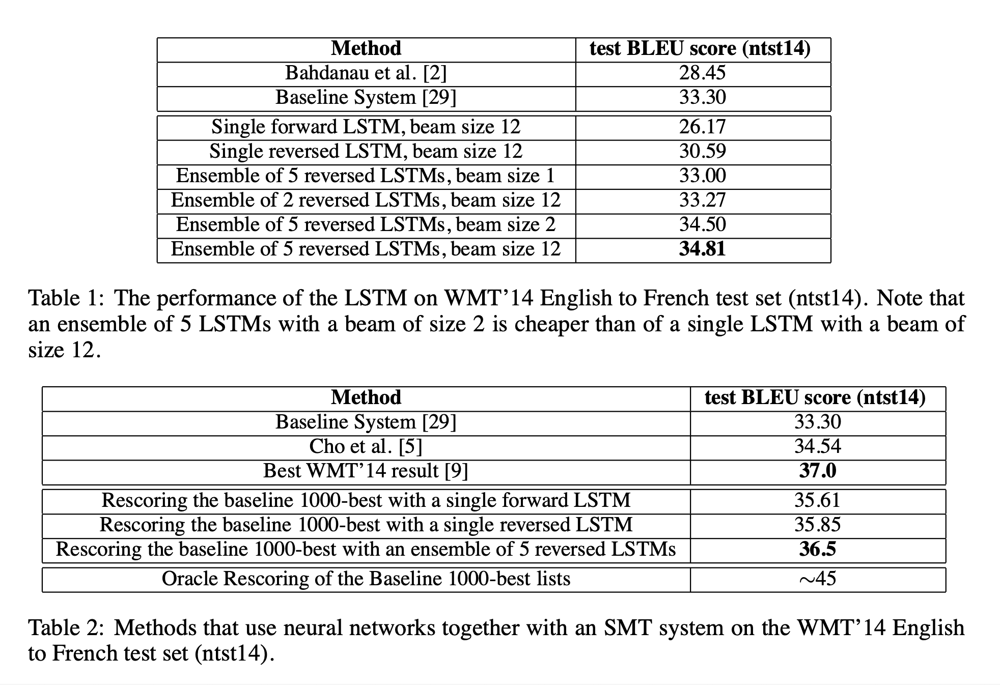

# Sequence to Sequence Learning with Neural Networks (2014), I. Sutskever et al.

###### contributors: [@GitYCC](https://github.com/GitYCC)

\[[paper](https://arxiv.org/pdf/1211.3711)\] \[[keras](https://github.com/keras-team/keras/blob/master/examples/lstm_seq2seq.py)\] \[[pytorch](https://github.com/bentrevett/pytorch-seq2seq/blob/master/1%20-%20Sequence%20to%20Sequence%20Learning%20with%20Neural%20Networks.ipynb)\]

---

- First seq2seq on machine translation
- Sequences pose a challenge for DNNs because they require that the dimensionality of the inputs and outputs is known and fixed. In this paper, we show that a straightforward application of the Long Short-Term Memory (LSTM) architecture can solve general sequence to sequence problems.
- The idea is to use one LSTM to read the input sequence, one timestep at a time, to obtain large fixed- dimensional vector representation, and then to use another LSTM to extract the output sequence from that vector (fig. 1). The second LSTM is essentially a recurrent neural network language model except that it is conditioned on the input sequence.
- 
- Our actual models differ from the above description in three important ways:
  1. we used two different LSTMs: one for the input sequence and another for the output sequence, because doing so increases the number model parameters at negligible computational cost and makes it natural to train the LSTM on multiple language pairs simultaneously.
  2. we found that deep LSTMs significantly outperformed shallow LSTMs, so we chose an LSTM with 4 layers
  3. we found it extremely valuable to reverse the order of the words of the input sentence
     - By reversing the words in the source sentence, the average distance between corresponding words in the source and target language is unchanged. However, the first few words in the source language are now very close to the first few words in the target language, so the problem’s minimal time lag is greatly reduced.
     - Initially, we believed that reversing the input sentences would only lead to more confident predictions in the early parts of the target sentence and to less confident predictions in the later parts. How- ever, LSTMs trained on reversed source sentences did much better on long sentences than LSTMs trained on the raw source sentences, which suggests that reversing the input sentences results in LSTMs with better memory utilization.
- It would be difficult to train the simple RNNs due to the resulting long term dependencies (figure 1). However, the Long Short-Term Memory (LSTM) is known to learn problems with long range temporal dependencies, so an LSTM may succeed in this setting.
- The goal of the LSTM is to estimate the conditional probability $p(y_1, \dots , y_{T'} |x_1, \dots , x_T )$
  - training objective: $\frac{1}{\mid\mathcal{D_{train}}\mid}\sum_{(T,S)\in\mathcal{D_{train}}}log\ p(T\mid S)$
  - inference: $T^*=argmax_T\ p(T\mid S)$ (with a simple left-to-right beam-search)
- On the WMT’14 English to French translation task, we obtained a BLEU score of 34.81 by directly extracting translations from an ensemble of 5 deep LSTMs (with 384M parameters and 8,000 dimensional state each) using a simple left-to-right beam-search decoder. This is by far the best result achieved by direct translation with large neural networks. For comparison, the BLEU score of an SMT baseline on this dataset is 33.30.
- But, in our case, we use relatively unoptimized small-vocabulary (only 80k). Finally, we used the LSTM to rescore the publicly available 1000-best lists of the SMT baseline on the same task. By doing so, we obtained a BLEU score of 36.5, which improves the baseline by 3.2 BLEU points and is close to the previous best published result on this task (which is 37.0).
  - details of rescoring: we computed the log probability of every hypothesis with our LSTM and took an even average with their score and the LSTM’s score
- 