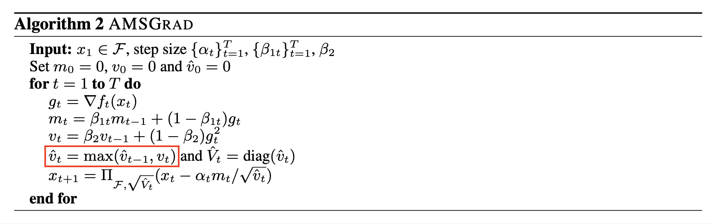

# On the Convergence of Adam and Beyond (2018), Sashank J. Reddi et al.

###### contributors: [@GitYCC](https://github.com/GitYCC)

\[[paper](https://arxiv.org/pdf/1904.09237.pdf)\]

---

### Abstract / Introduction

- Several recently proposed stochastic optimization methods that have been successfully used in training deep networks such as RMSPROP, ADAM, ADADELTA, NADAM are based on using gradient updates scaled by square roots of exponential moving averages of squared past gradients.
- In many applications, it has been empirically observed that these algorithms fail to converge to an optimal solution (or a critical point in nonconvex settings). We show that one cause for such failures is the exponential moving average used in the algorithms.

- Key Contributions:
  - We elucidate how the exponential moving average in the RMSPROP and ADAM algorithms can cause non-convergence by providing an example of simple convex optimization problem where RMSPROP and ADAM provably do not converge to an optimal solution.
  - The above result indicates that in order to have guaranteed convergence the optimization algorithm must have “long-term memory” of past gradients. To resolve this issue, we propose new variants of ADAM which rely on long-term memory of past gradients, but can be implemented in the same time and space requirements as the original ADAM algorithm.

### The Non-Convergence of Adam

- General form of SGD, ADAGRAD, RMSPROP, ADAM, ...:

  - 
- We show that ADAM can fail to converge to an optimal solution even in simple one-dimensional convex settings. These examples of non-convergence contradict the claim of convergence in (Kingma & Ba, 2015), and the main issue lies in the following quantity of interest:

  - 
  - This quantity essentially measures the change in the inverse of learning rate of the adaptive method with respect to time. One key observation is that for SGD and ADAGRAD, $Γ_t \geq 0$ for all $t \in [T]$. However, this is not necessarily the case for exponential moving average (EMA) variants like ADAM and RMSPROP i.e., $Γ_t$ can potentially be indefinite for $t \in [T]$ .
- Counterexample
  - Consider the following simple sequence of linear functions for $F = [−1, 1]$: 
  - 
  - where $C > 2$. For this function sequence, it is easy to see that the point $x = −1$ provides the minimum regret.
  - Suppose $β_1 = 0$ and $β_2 = 1/(1 + C^2)$. We show that ADAM converges to a highly suboptimal solution of $x = +1$ for this setting.
  - Intuitively, the reasoning is as follows. The algorithm obtains the large gradient $C$ once every 3 steps, and while the other 2 steps it observes the gradient −1, which moves the algorithm in the wrong direction. The large gradient $C$ is unable to counteract this effect since it is scaled down by a factor of almost $C$ for the given value of $β_2$, and hence the algorithm converges to 1 rather than −1. (if $\alpha=1$)
    - step1: gradient = -1, $\sqrt{V_t}=0$, $-\alpha_tg_t/\sqrt{V_t}=0$ weight $x=0$
    - step2: gradient = -1, $\sqrt{V_t}=\sqrt{\frac{C^2}{1+C^2}}\sim 1$, $-\alpha_tg_t/\sqrt{V_t}=1$ => weight $x=1$
    - step3: gradient = C, $\sqrt{V_t}=\sqrt{\frac{1+C^4}{1+C^2}}\sim C$, $-\alpha_tg_t/\sqrt{V_t}=-1$ => weight $x=0$  [The large gradient $C$ is unable to counteract this effect since it is scaled down by a factor of almost $C$ for the given value of $β_2$]
    - step4: gradient = -1, $\sqrt{V_t}=\sqrt{\frac{2C^2}{1+C^2}}\sim \sqrt{2}$, $-\alpha_tg_t/\sqrt{V_t}=0.7$ => weight $x=0.7$
    - step5: gradient = -1, $\sqrt{V_t}=\sqrt{\frac{3C^2}{1+C^2}}\sim \sqrt{3}$, $-\alpha_tg_t/\sqrt{V_t}=0.6$ => weight $x=1$
    - step6: gradient = C, $\sqrt{V_t}=\sqrt{\frac{3+C^4}{1+C^2}}\sim C$, $-\alpha_tg_t/\sqrt{V_t}=-1$ => weight $x=0$
    - ...

### A New Exponential Moving Average Variant: AMSGrad

- AMSGRAD results in a non-increasing step size and avoids the pitfalls of ADAM and RMSPROP i.e., $Γ_t \ge 0$ for all $t \in [T]$ even with constant $β_2$.

- The resulting algorithm is very similar to ADAGRAD except for normalization with smoothed gradients rather than actual gradients and can be shown to have similar convergence as ADAGRAD.

