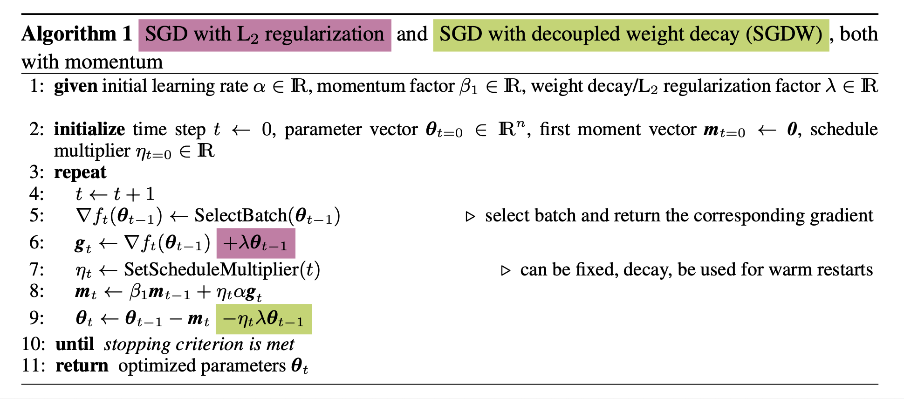
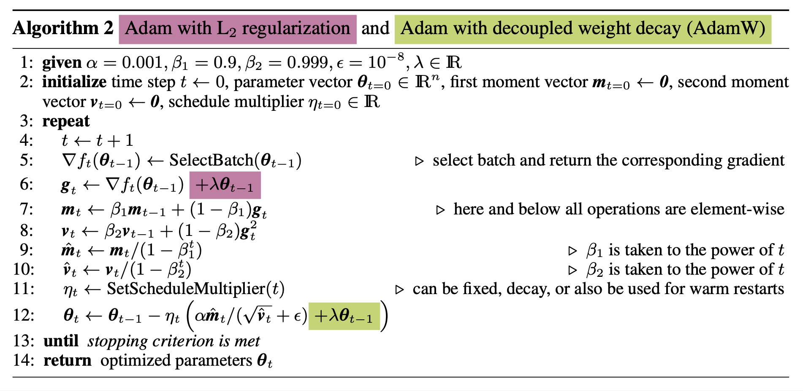
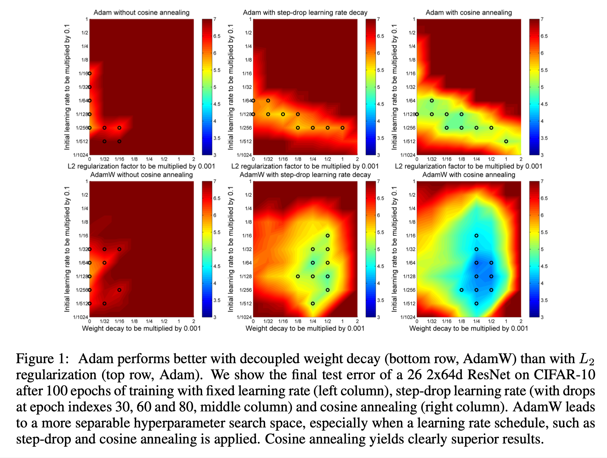
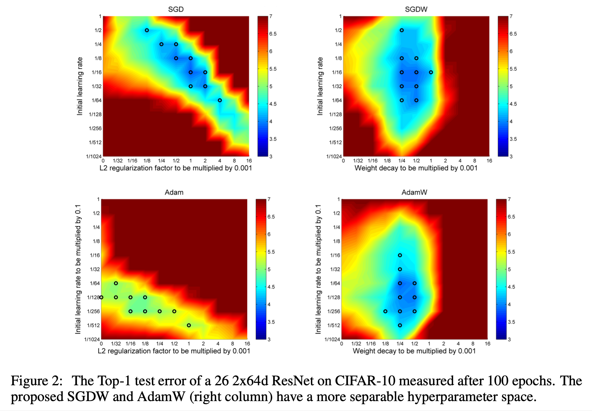
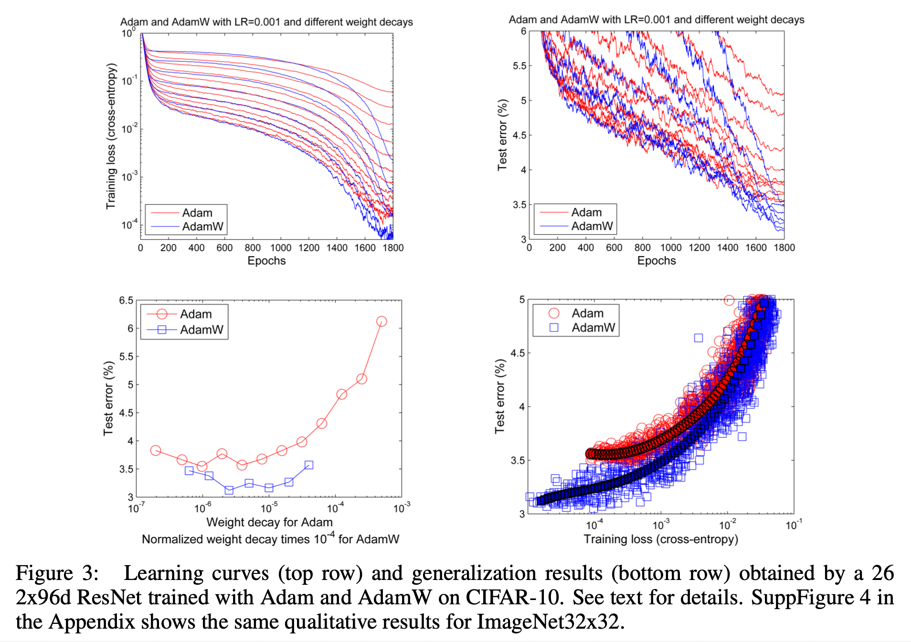
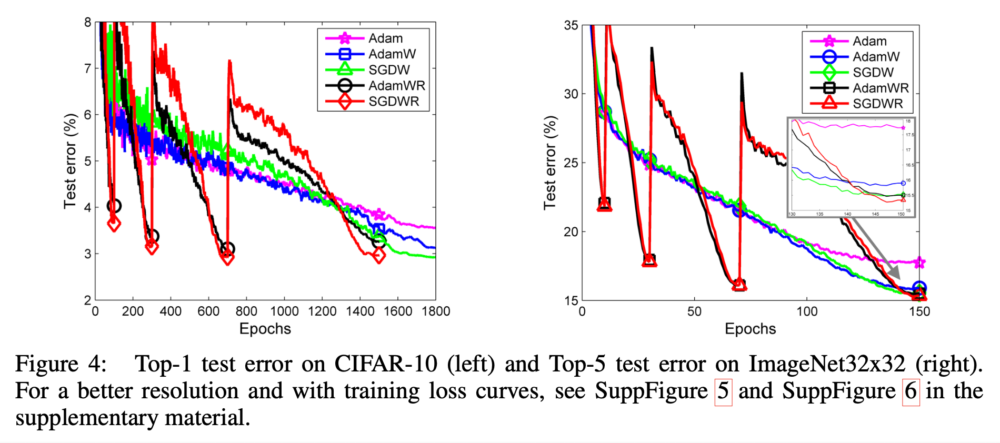

# Decoupled Weight Decay Regularization (2019), Ilya Loshchilov et al.

###### contributors: [@GitYCC](https://github.com/GitYCC)

\[[paper](https://arxiv.org/pdf/1711.05101.pdf)\]

---

### Abstract / Introduction

- L2 regularization and weight decay regularization are equivalent for standard stochastic gradient descent, but as we demonstrate this is not the case for adaptive gradient algorithms, such as Adam. 
- We propose a simple modification to recover the original formulation of weight decay regularization by decoupling the weight decay from the optimization steps taken.
- Our analysis of Adam leads to the following observations:
  - L2 regularization and weight decay are not identical
  - L2 regularization is not effective in Adam
  - Weight decay is equally effective in both SGD and Adam
- The main contribution of this paper is to **improve regularization in Adam by decoupling the weight decay from the gradient-based update**

### Decoupling the Weight Decay from the Gradient-based Update

- L2 regularization and weight decay regularization are equivalent for standard stochastic gradient descent.
  - L2 regularization: $f^{reg}(\theta)=f(\theta)+\frac{\lambda/\alpha}{2}||\theta||^2$
  - L2 regularization + gradient decent: $\theta_{t+1}=\theta_t-\alpha \nabla f^{reg}(\theta_t)=(1-\lambda)\theta_t-\alpha \nabla f(\theta_t)$
  - weight decay: $\theta_{t+1}=(1-\lambda)\theta_t-\alpha \nabla f(\theta_t)$
- But this is not the case for adaptive gradient algorithms, such as Adam.
  - L2 regularization + Adam: $\theta_{t+1}=\theta_t-\alpha\frac{\beta_1m_{t-1}+(1-\beta_1)g_t}{\sqrt{\beta_2v_{t-1}+(1-\beta_2)g_t^2}+ε}$
    - where: $g_t=\nabla f_t(\theta_{t-1})+\lambda\theta_{t-1}$

- Their equivalence between L2 regularization and weight decay for standard SGD remains very helpful for intuition: both mechanisms push weights closer to zero, at the same rate.
- However, for adaptive gradient algorithms they differ:
  - With L2 regularization, the sums of the gradient of the loss function and the gradient of the regularizer are adapted, whereas with decoupled weight decay, only the gradients of the loss function are adapted.
  - With L2 regularization both types of gradients are normalized by their typical (summed) magnitudes, and therefore weights $x$ with large typical gradient magnitude $s$ are regularized by a smaller relative amount than other weights. 
  - In contrast, decoupled weight decay regularizes all weights with the same rate $λ$, effectively regularizing weights $x$ with large $s$ more than standard L2 regularization does.

### Experimental Validation

- Following suggestions that adaptive gradient methods such as Adam might lead to worse generalization than SGD with momentum (Wilson et al., 2017), we identified and exposed the inequivalence of L2 regularization and weight decay for Adam. We empirically showed that our version of Adam with decoupled weight decay yields substantially better generalization performance than the com- mon implementation of Adam with L2 regularization. 
- We also proposed to use warm restarts for Adam to improve its anytime performance.

