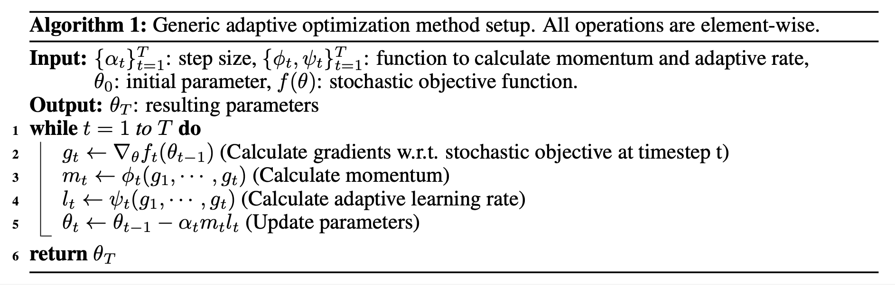
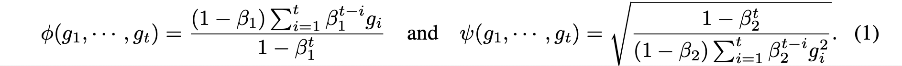
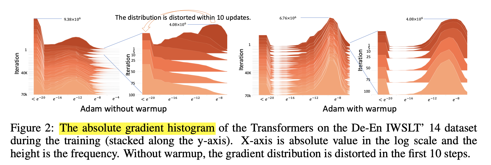
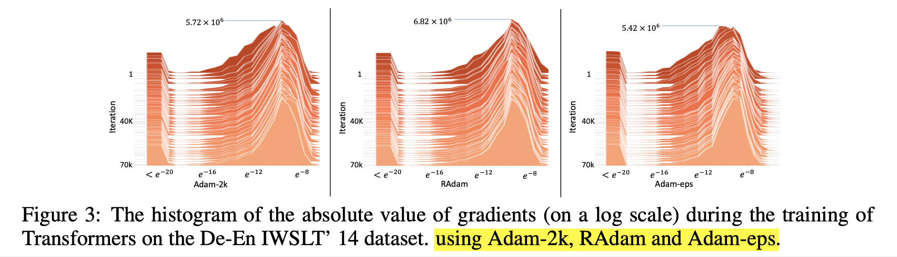
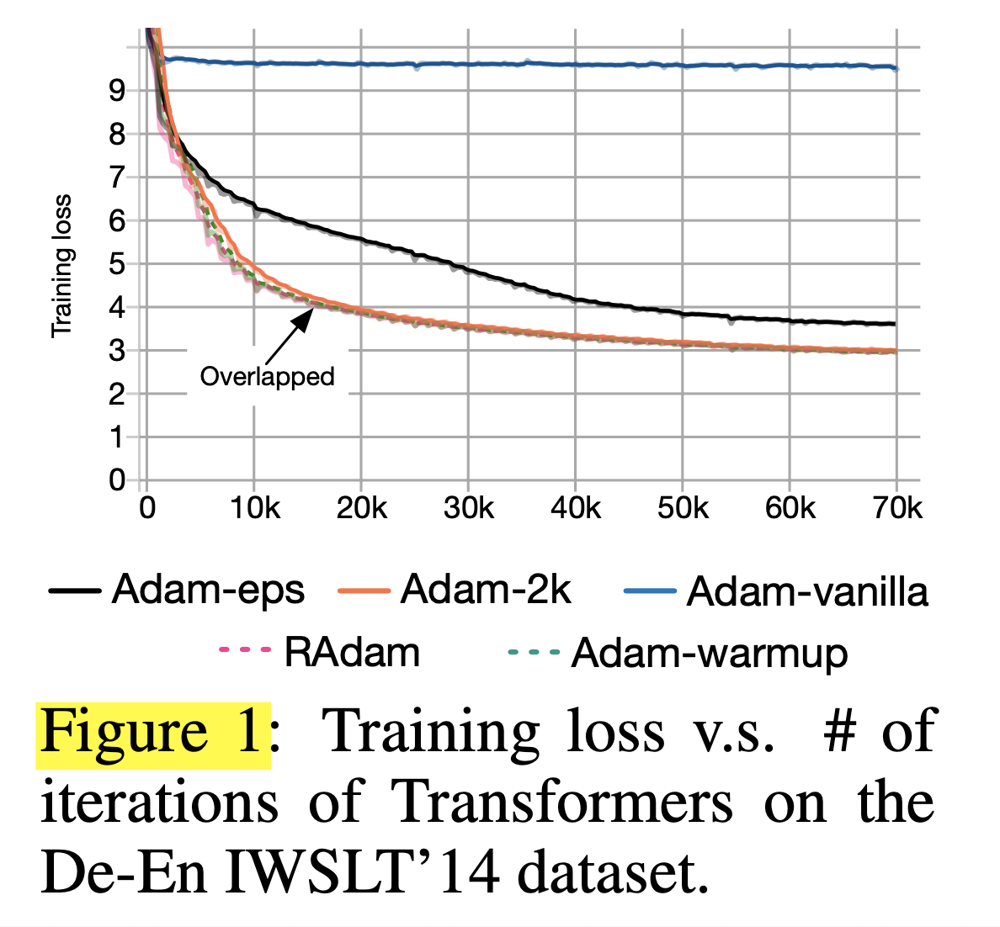
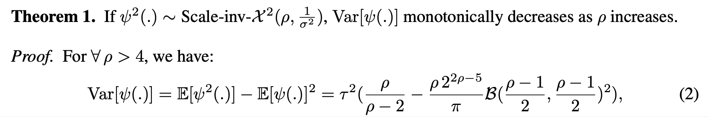
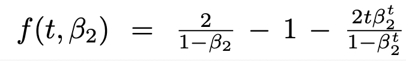
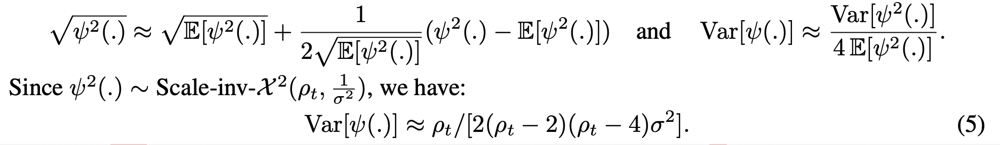
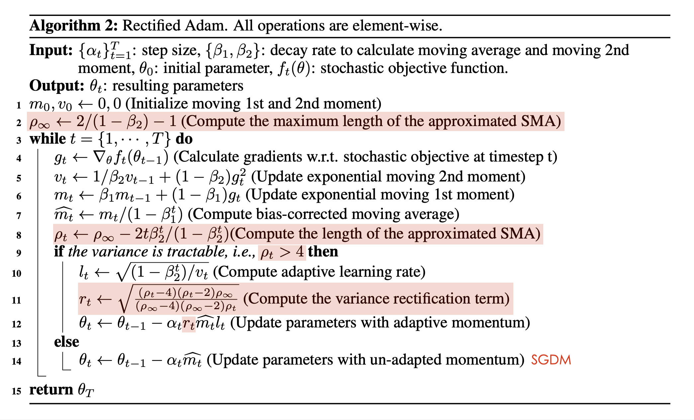

# On the Variance of the Adaptive Learning Rate and Beyond (2020), Michael Liyuan Liu et al.

###### contributors: [@GitYCC](https://github.com/GitYCC)

\[[paper](https://arxiv.org/pdf/1908.03265.pdf)\]

---

### Abstract / Introduction

**In summary, our main contributions are two-fold:**

- We identify the variance issue of the adaptive learning rate and present a theoretical justification for the warmup heuristic. We show that the convergence issue is due to the undesirably large variance of the adaptive learning rate in the early stage of model training.
  - It has been observed that these optimization methods (Adagrad, RMSprop, Adam, Adadelta and Nadam) may converge to bad/suspicious local optima, and have to resort to a warmup heuristic – using a small learning rate in the first few epochs of training to mitigate such problem
  - We presume warmup works as a variance reduction technique.
  - We show that its root cause is: the adaptive learning rate has undesirably large variance in the early stage of model training, due to the limited amount of training samples being used. Thus, to reduce such variance, it is better to use smaller learning rates in the first few epochs of training, which justifies the warmup heuristic.
  - Due to the lack of the theoretical underpinnings, there is neither guarantee that warmup would bring consistent improvements for various machine learning settings nor guidance on how we should conduct warmup. Thus, researchers typically use different settings in different applications and have to take a trial-and-error approach, which can be tedious and time-consuming.
- We propose a new variant of Adam (i.e., RAdam), which not only explicitly rectifies the variance and is theoretically sound, but also compares favorably with the heuristic warmup.
  - by introducing a term to rectify the variance of the adaptive learning rate
  - Experimental results on image classification, language modeling, and neural machine translation verify our intuition and demonstrate the efficacy and robustness of RAdam.

### Preliminaries and Motivations

- Generic adaptive methods:
  - 
  - Adam:
    - 
- Learning rate warmup:
  - We observe that, without applying warmup, the gradient distribution is distorted to have a mass center in relatively small values within 10 updates. Such gradient distortion means that the vanilla Adam is trapped in bad/suspicious local optima after the first few updates. Warmup essentially reduces the impact of these problematic updates to avoid the convergence problem.
  - 

### Variance of the Adaptive Learning Rate

- **Our hypothesis – Due to the lack of samples in the early stage, the adaptive learning rate has an undesirably large variance, which leads to suspicious/bad local optima.**

**Warmup as Variance Reduction**

- we design two variants of Adam that reducing the variance of the adaptive learning rate: 
  - Adam-2k: only updates $ψ(.)$ in the first 2k iterations, while the momentum $φ(.)$ and parameters $θ$ are fixed; other than this, it follows the original Adam algorithm.
  - Adam-eps: If we assume $\hat{ψ􏰧}(.)=\frac{\sqrt{1-\beta_2^t}}{ε+\sqrt{...}}$ is subject to the uniform distribution, its variance equals to $1/12ε^2$. Therefore, we design Adam-eps, which uses a non-negligibly large $ε = 10^{-4}$ , while $ε = 10^{−8}$ for vanilla Adam.

- Adam-eps produces a much worse performance comparing to Adam-2k and Adam-warmup. We conjecture that this is because large $ε$ induces a large bias into the adaptive learning rate and slows down the optimization process.

**Analysis of Adaptive Learning Rate Variance**

- we approximate the distribution of the exponential moving average as the distribution of the simple average
  - i.e. $p(ψ(.))=p(\sqrt{\frac{1-\beta_2^t}{(1-\beta_2)\sum_{i=1}^{t}\beta_2^{t-i}g_i^2}})\approx p(\sqrt{\frac{t}{\sum_{i=1}^{t}g_i^2}})$
  - For gradients $\{g_1,..,g_t\}$, their exponential moving average has a larger variance than their simple average.
  - In the early stage (t is small), the difference of the exponential weights of $\{g_1,..,g_t\}$ is relatively small, because of $\beta_2\approx 1$ , $t\approx 1$ and $\beta_2^{t-i}\approx 1$.
- Assume $g_i\sim \mathcal{N}(0,\sigma^2)$, we have $\frac{t}{\sum_{i=1}^{t}g_i^2}\sim \text{Scale-inv-}\mathcal{X}(t,1/\sigma^2)$, where: $\text{Scale-inv-}\mathcal{X}$ means the scaled inverse chi-squared distribution. Therefore, we assume $\frac{1-\beta_2^t}{(1-\beta_2)\sum_{i=1}^{t}\beta_2^{t-i}g_i^2}$ also subjects to a scaled inverse chi-square distribution with $ρ$ degrees of freedom (further analysis on this approximation is conducted).
- 
- When $ρ\leq 4$, $Var[ψ(.)]$ is divergent. It means that the adaptive ratio can be undesirably large in the first stage of learning. Meanwhile, setting a small learning rate at the early stage can reduce the variance ($Var[αx] = α^2 Var[x]$), thus alleviating this problem. Therefore, we suggest it is the unbounded variance of the adaptive learning rate in the early stage that causes the problematic updates.

### Rectified Adaptive Learning Rate

**Estimation of ρ**

- The exponential moving average (EMA) can be interpreted as an approximation to the simple moving average (SMA) in real application (Nau, 2014), i.e.,
  - 
  - where $f(t,β_2)$ is the length of the SMA which allows the SMA to have the same “center of mass” with the EMA. In other words, $f (t, β_2 )$ satisfies:
    - 
    - solve above eq.,:
      - 

- Therefore, we treat $f (t, β_2 )$ as an estimation of $ρ$: $ρ_t=f(t,\beta_2)$
- maximum length of the approximated SMA: $ρ_\infin =lim_{t\rightarrow\infin}ρ_t=\frac{2}{1-\beta_2}-1$
  - $ρ_t\leqρ_\infin$
  - so, $ρ_t=ρ_\infin-\frac{2t\beta^t_2}{1-\beta^t_2}$

**Variance Estimation and Rectification**

- Additionally, based on Theorem 1, we know $min_{ρ_t}Var[ψ(.)]=Var[ψ(.)]|_{ρ_t=ρ_\infin}$ and mark this minimal value as $C_{var}$
- In order to ensure that the adaptive learning rate $ψ(.)$ has consistent variance, we rectify the variance at the t-th timestamp as below,
  - 
  - we hope to minimize variance!
- Although we have the analytic form of $Var[ψ(.)]$ (i.e., Equation 2), it is not numerically stable. Therefore, we use the first-order approximation to calculate the rectification term. Specifically, by approximating 􏰑$ψ^2(.)$ to the first order (Wolter, 2007),
  - 
  - 

- Applying our rectification term to Adam, we come up with a new variant of Adam, Rectified Adam (RAdam), as summarized in Algorithm 2. Specifically, when the length of the approximated SMA is less or equal than 4, the variance of the adaptive learning rate is intractable and the adaptive learning rate is inactivated. Otherwise, we calculate the variance rectification term and update parameters with the adaptive learning rate. It is worth mentioning that, if $β_2 ≤ 0.6$, we have $ρ_∞ ≤ 4$ and RAdam is degenerated to SGD with momentum.

