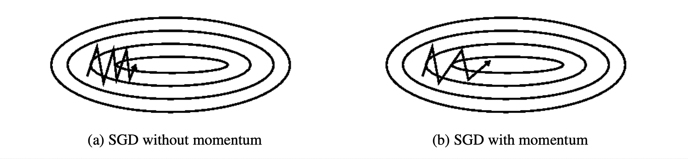
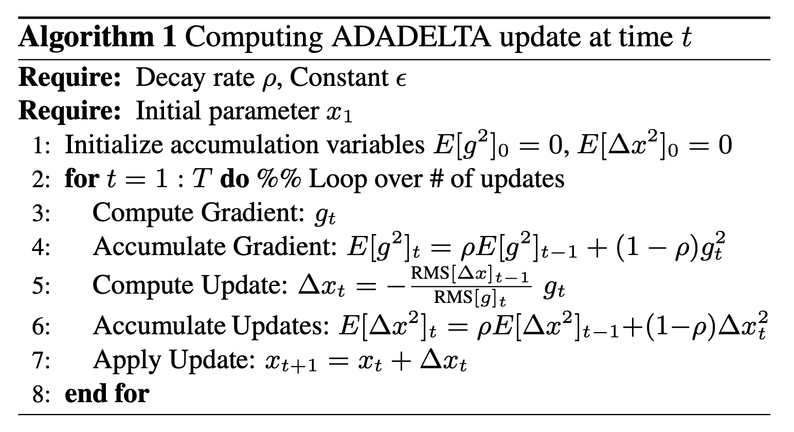
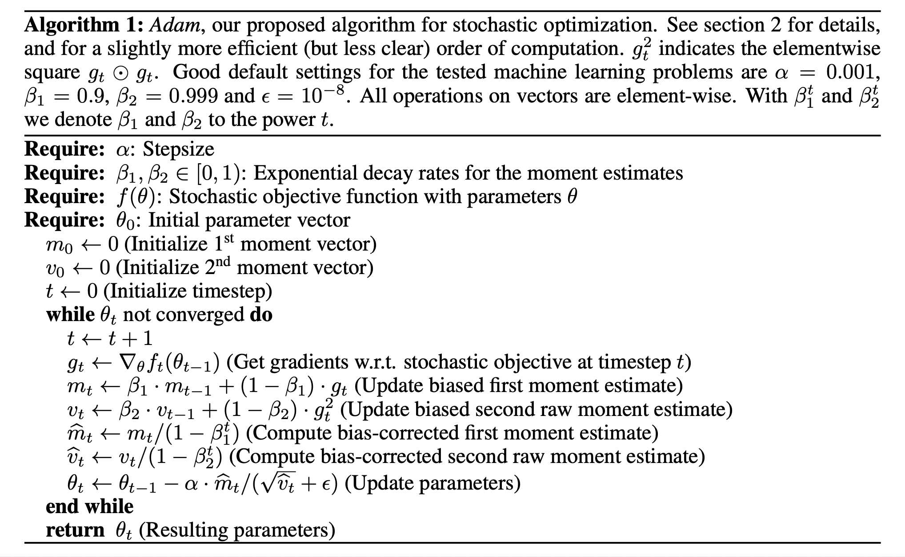

# An overview of gradient descent optimization algorithms (2017), S. Ruder.

###### contributors: [@GitYCC](https://github.com/GitYCC)

\[[paper](https://arxiv.org/pdf/1609.04747.pdf)\]

---

### Gradient descent variants

- While batch gradient descent converges to the minimum of the basin the parameters are placed in, SGD’s fluctuation, on the one hand, enables it to jump to new and potentially better local minima.

$$
\theta_{t+1}=\theta_t-\eta\cdot g_t
$$

### Challenges

Vanilla mini-batch gradient descent, however, does not guarantee good convergence, but offers a few challenges that need to be addressed:

- Choosing a proper learning rate can be difficult
- Learning rate schedules try to adjust the learning rate during training
- The same learning rate applies to all parameter updates. If our data is sparse and our features have very different frequencies, we might not want to update all of them to the same extent, but perform a larger update for rarely occurring features
- Another key challenge of minimizing highly non-convex error functions common for neural networks is avoiding getting trapped in their numerous suboptimal local minima or saddle points

### Gradient descent optimization algorithms

#### Momentum

SGD has trouble navigating ravines. In these scenarios, SGD oscillates across the slopes of the ravine while only making hesitant progress along the bottom towards the local optimum.

$$
\theta_{t+1}=\theta_t- v_t
$$
where: $v_t=\gamma v_{t-1}+\eta\cdot g_t$

The momentum term increases for dimensions whose gradients point in the same directions and reduces updates for dimensions whose gradients change directions. As a result, we gain faster convergence and reduced oscillation.

#### Nesterov accelerated gradient

- This anticipatory update prevents us from going too fast and results in increased responsiveness, which has significantly increased the performance of RNNs on a number of tasks

$$
\theta_{t+1}=\theta_t- v_t
$$
where: $v_t=\gamma v_{t-1}+\eta\cdot g_t(\theta-\gamma v_{t-1})$

#### Adagrad

Adagrad adapts the learning rate to the parameters, performing larger updates for infrequent and smaller updates for frequent parameters. For this reason, it is well-suited for dealing with sparse data.
$$
\theta_{t+1,i}=\theta_{t,i}-\frac{\eta}{\sqrt{G_{t,i}+\epsilon}}\cdot g_{t,i}
$$
where: $G_{t,i}=\sum_{k=1}^{k=t}g_{k,i}^2$ (contains the sum of the squares of the past gradients)

- problem: Since every added term is positive, the accumulated sum keeps growing during training. This in turn causes the learning rate to shrink and eventually become infinitesimally small, at which point the algorithm is no longer able to acquire additional knowledge. 

#### Adadelta

- Adadelta is an extension of Adagrad that seeks to reduce its aggressive, monotonically decreasing learning rate.
- To match the units, they define another exponentially decaying average, this time not of squared gradients but of squared parameter updates $RMS[\triangle x]_{t-1}$

### RMSprop

$$
E[g^2]_t=0.9E[g^2]_{t-1}+0.1g_t^2
$$

$$
\theta_{t+1}=\theta_{t}-\frac{\eta}{\sqrt{E[g^2]_t+\epsilon}}\cdot g_{t}
$$

#### Adam

- Adam = RMSprop + bias-correction + momentum

#### AdaMax

$$
u_t=max(\beta_2\cdot v_{t-1},|g_t|)
$$

$$
\theta_{t+1}=\theta_{t}-\frac{\eta}{u_t}\cdot \hat{m}_t
$$

#### Nadam

### Which optimizer to use?

- If your input data is sparse, then you likely achieve the best results using one of the adaptive learning-rate methods.
- Bias-correction helps Adam slightly outperform RMSprop towards the end of optimization as gradients become sparser.

