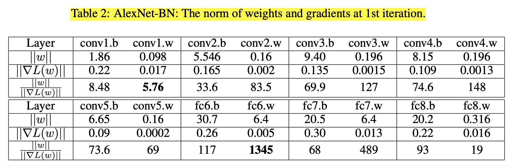
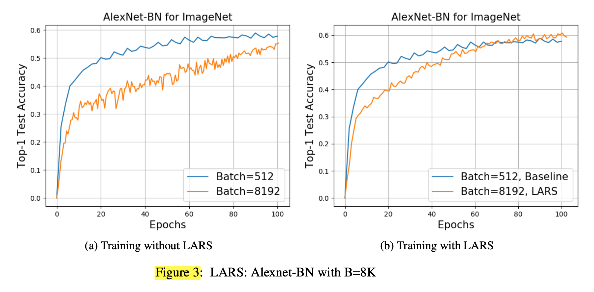
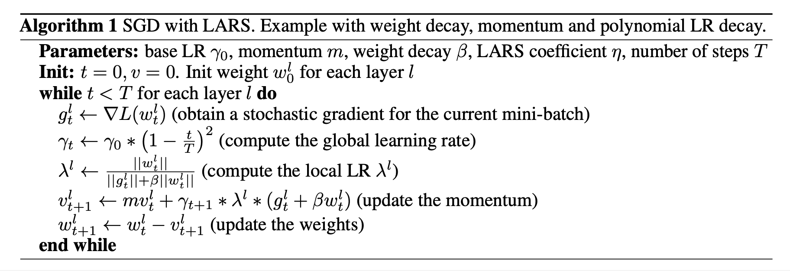

# Large Batch Training of Convolutional Networks (2017), Yang You.

###### contributors: [@GitYCC](https://github.com/GitYCC)

\[[paper](https://arxiv.org/pdf/1708.03888.pdf)\]

---

- Problem: A common way to speed up training of large convolutional networks is to add computational units. With an increase in the number of nodes, the batch size grows. But training with large batch size often results in the lower model accuracy. 

  - Increasing the global batch while keeping the same number of epochs means that you have fewer iterations to update weights
  - Another problem related to large batch training is so called "generalization gap", observed by Keskar et al. (2016). They came to conclusion that "the lack of generalization ability is due to the fact that large-batch methods tend to converge to sharp minimizers of the training function." They tried a few methods to improve the generalization with data augmentation and warm-starting with small batch, but they did not find a working solution.

- Possible Solution: linear learning rate (LR) scaling with warm-up

  - linear LR scaling:

    - The weight updates for batch size $B$ after 2 iterations would be:

      

    - The weight update for the batch $B_2 = 2 ∗ B$ with learning rate $λ_2$:
      
    - will be similar if you take $λ_2 =2∗λ$, assuming that $∇L(x_j,w_t+1)≈L(x_j,w_t)$.

  - LR warm-up:  training starts with small LR, and then LR is gradually increased to the target. After the warm-up period (usually a few epochs), you switch to the regular LR policy ("multi-steps", polynomial decay etc).

- We argue that the current recipe for large batch training (linear learning rate scaling with warm-up) is not general enough and training may diverge.

  - while increasing the learning rate (LR), networks may diverge
  - The scaling of Alexnet above 2K is difficult, since the training diverges for larger LRs
  - When LR $λ$ is large, the update $||λ ∗ ∇L(w_t)||$ can become larger than $||w||$, and this can cause the divergence. 
  - We found that the ratio the L2-norm of weights and gradients $||w||/||∇L(wt)||$ varies significantly between weights and biases, and between different layers.
    - 

- Layer-wise Adaptive Rate Scaling (LARS)

  - To analyze the training stability with large LRs we measured the ratio between the norm of the layer weights and norm of gradients update. We observed that if this ratio is too high, the training may become unstable. On other hand, if the ratio is too small, then weights don’t change fast enough. This ratio varies a lot between different layers, which makes it necessary to use a separate LR for each layer. Thus we propose a novel Layer-wise Adaptive Rate Scaling (LARS) algorithm. There are two notable differences:
    - LARS uses a separate learning rate for each layer and not for each weight, which leads to better stability.
    - the magnitude of the update is controlled with respect to the weight norm for better control of training speed. 
  - Using LARS, we scaled Alexnet up to a batch size of 8K, and Resnet-50 to a batch size of 32K without loss in accuracy.
    - 
  - Algorithm:
    - 

