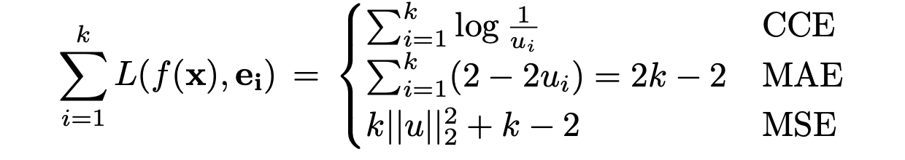

# Learning from Noisy Labels with Deep Neural Networks: A Survey (2020), Hwanjun Song et al.

###### contributors: [@GitYCC](https://github.com/GitYCC)

\[[paper](https://arxiv.org/pdf/2007.08199.pdf)\]

---

### Introduction

- Unfortunately, popular regularization techniques, such as data augmentation [21], weight decay [22], dropout [23], and batch normalization [24], do not completely overcome the overfitting issue.

### Preliminaries

**A. Supervised Learning with Noisy Labels**

**B. Taxonomy of Label Noise**

- label transition matrix $T$: $T_{ij}=p(\tilde{y}=j|y=i)$ is the probability of the true label

  $i$ being flipped into a corrupted label $j$

- Taxonomy of Label Noise

  - *symmetric (or uniform) noise*: a true label is flipped into other labels with equal probability
  - *asymmetric (or label-dependent) noise*: a true label is more likely to be mislabeled into a particular label
    - pair noise: a true label is flipped into only a certain label
  - *instance- and label-dependent noise*: Above family of label noises is not realistic because wrong annotations are made regardless of data features. For more realistic noise modeling, the corruption probability is assumed to be dependent on both the data features and class labels.

**C. Non-deep Learning Approaches**

- Data Cleaning
- Surrogate Loss: noise-tolerance of the 0-1 loss function
  - However, these loss functions cannot support the multi-class classification task.
- Probabilistic Method
- Model-based Method

### Deep Learning Approaches

**A. Robust Loss Function**

-  loss function is defined to be noise-tolerant for a $c$-class classification under symmetric noise if

  the function satisfies the noise rate $τ < (c−1)/c$ and 
  
  where $C$ is a constant. This condition guarantees that the classifier trained on noisy data has the same misclassification probability as that trained on noise-free data under the specified assumption.

- CCE v.s. robust MAE

  - For the classification task, the categorical cross entropy (CCE) loss is the most widely used loss function owing to its fast convergence and high generalization capability.
  - The mean absolute error (MAE) loss achieves better generalization than the CCE loss because only the MAE loss satisfies the aforementioned condition.
    - 
  - A limitation of the MAE loss is that its generalization performance degrades significantly when complicated data are involved.

- Generalized cross entropy (GCE): achieve the advantages of both MAE and CCE losses

- symmetric cross entropy (SCE)

- curriculum loss (CL)

**B. Robust Architecture**

- Noise Adaptation Layer: adding a noise adaptation layer at the top of the softmax layer to mimic the noise behavior
  - The drawback of this family is the strong assumption regarding the noise type, which hinders a model’s generalization to complex label noise
- Dedicated Architecture:
  - probabilistic noise modeling [15] manages two independent networks, each of which is specialized to predict the noise type and label transition probability.
  - masking [62] is a human-assisted approach to convey the human cognition of invalid label transitions
  - a variant of generative adversarial networks (GANs)

**C. Robust Regularization**

- data augmentation [21], weight decay [22], dropout [23], batch normalization [24], adversarial training [64] and label smoothing [65]
  - However, they are generic regularization techniques that are not specialized in handling label noise; hence, poor generalization could be obtained when the noise is heavy [68].
- mixup
- Bilevel learning [67] uses a clean validation dataset to regularize the overfitting of a model by introducing a bilevel optimization approach, which differs from the conventional one in that its regularization constraint is also an optimization problem.
- annotator confusion [68] assumes the existence of multiple annotators and introduces a regularized EM-based approach to model the label transition probability
- pre-training

**D. Loss Adjustment**

