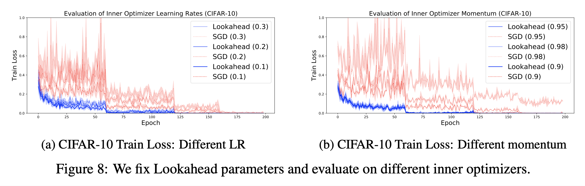

# Lookahead Optimizer: k steps forward, 1 step back (2019), Michael R. Zhang et al.

###### contributors: [@GitYCC](https://github.com/GitYCC)

\[[paper](https://arxiv.org/pdf/1907.08610.pdf)\]

---

- Lookahead first updates the “fast weights” k times using any standard optimizer in its inner loop before updating the “slow weights” once in the direction of the final fast weights.
  - 
- Standard optimization methods typically require carefully tuned learning rates to prevent oscillation and slow convergence. Lookahead, however, benefits from a larger learning rate in the inner loop. When oscillating in the high curvature directions, the fast weights updates make rapid progress along the low curvature directions. The slow weights help smooth out the oscillations through the parameter interpolation. The combination of fast weights and slow weights improves learning in high curvature directions, reduces variance, and enables Lookahead to converge rapidly in practice.
- Empirical analysis: 
  - Robustness to inner optimization algorithm, the number of fast weight updates k, and the slow weights learning rate α. Therefore, lessens the need for extensive hyperparameter tuning.
    - 
    - 
  - The slow weights step recovers the outer loop variance and restores the test accuracy.
    - 
- Experiments
  - CIFAR
    - 
  - ImageNet
    - 
  - Penn Treebank and WMT-14 machine translation task
    - 

