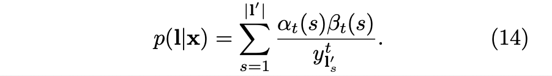

# Connectionist Temporal Classification: Labelling Unsegmented Sequence Data with Recurrent Neural Networks (2006), Alex Graves et al.

###### contributors: [@GitYCC](https://github.com/GitYCC)

\[[paper](https://dl.acm.org/doi/10.1145/1143844.1143891)\]

---

### Introduction

- drawbacks of HMMs or CRFs
  - require a significant amount of task specific knowledge
    - to design the state models for HMMs
    - to choose the input features for CRFs
  - require explicit (and often questionable) dependency assumptions to make inference tractable
    - the assumption that observations are independent for HMMs
- RNNs require no prior knowledge of the data, beyond the choice of input and output representation. They can be trained discriminatively, and their internal state provides a powerful, general mechanism for modelling time series. In addition, they tend to be robust to temporal and spatial noise.
- RNNs can only be trained to make a series of independent label classifications. This means that the training data must be pre-segmented, and that the network outputs must be post-processed to give the final label sequence.
  - applicability of RNNs has so far been limited.
- This paper presents a novel method for training RNNs to label unsegmented sequences directly.

### Connectionist Temporal Classification (CTC)

- A CTC network has a softmax output layer.
- The activation of the extra unit is the probability of observing a ‘blank’, or no label. 
- These outputs define the probabilities of all possible ways of aligning all possible label sequences with the input sequence. 
- The total probability of any one label sequence can then be found by summing the probabilities of its different alignments.
  
  - $L'=L\cup\{blank\}$
  - $\pi$ means a possible path
- We use $B$ to define the conditional probability of a given labelling $l$ as the sum of the probabilities of all the paths corresponding to it:
  
  - mapping $B$: simply removing all blanks and repeated labels from the paths (e.g. $B(a − ab−) = B(−aa − −abb) = aab$).
- Decoding (inference)
  - The first method (best path decoding) is based on the assumption that the most probable path will correspond to the most probable labelling:
    
  - The second method (prefix search decoding) relies on the fact that, by modifying the forward-backward algorithm, we can efficiently calculate the probabilities of successive extensions of labelling prefixes
    

### Training the Network

#### The CTC Forward-Backward Algorithm

To allow for blanks in the output paths, we consider a modified label sequence $l′$, with blanks added to the beginning and the end and inserted between every pair of labels. ($|l'|=2|l|+1$)

Initialization:

Recursion:

$$
\alpha_t(s)= 
\begin{cases}
    [\alpha_{t-1}(s)+\alpha_{t-1}(s-1)]y_{l'_s}^t& \text{if } l'_s=b\text{ or }l'_{s-2}=l'_s\\
    [\alpha_{t-1}(s)+\alpha_{t-1}(s-1)+\alpha_{t-1}(s-2)]y_{l'_s}^t   & \text{otherwise}
\end{cases}
$$

**Mapping from $l'$ to $l$:**

---

Initialization:

Recursion:
$$
\beta_t(s)= 
\begin{cases}
    [\beta_{t+1}(s)+\beta_{t+1}(s+1)]y_{l'_s}^t& \text{if } l'_s=b\text{ or }l'_{s+2}=l'_s\\
    [\beta_{t+1}(s)+\beta_{t+1}(s+1)+\beta_{t+1}(s+2)]y_{l'_s}^t   & \text{otherwise}
\end{cases}
$$

#### Maximum Likelihood Training

Since the training examples are independent we can consider them separately:

from (3), for any $t$, we can therefore sum over all $s$ to get:

Back to (13):

we could get $p(l|x)$ from (8) and $\frac{\partial p(l|x)}{\partial y_k^t}$ from (14), shown bellow:
$$
\frac{\partial p(l|x)}{\partial y_k^t}=\frac{\partial}{\partial y_k^t}[\sum_{s\in lab(l,k)}\frac{\alpha_t(s)\beta_t(s)}{y_{l'_s}^t}]
$$
(where label $k$ occurs as $lab(l,k)=\{s:l'_s=k\}$,  which may be empty.)
$$
=\frac{\partial}{\partial y_k^t}[\sum_{s\in lab(l,k)}\frac{(\cdots)y_{l'_s}^t\times y_{l'_s}^t(\cdots)}{y_{l'_s}^t}]
$$

$$
=\sum_{s\in lab(l,k)}\frac{(\cdots)y_{l'_s}^t\times y_{l'_s}^t(\cdots)}{[y_{l'_s}^{t}]^2}
$$

$$
\Rightarrow	\frac{\partial p(l|x)}{\partial y_k^t}=\frac{1}{[y_{l'_s}^{t}]^2}\sum_{s\in lab(l,k)}\alpha_t(s)\beta_t(s)
$$

