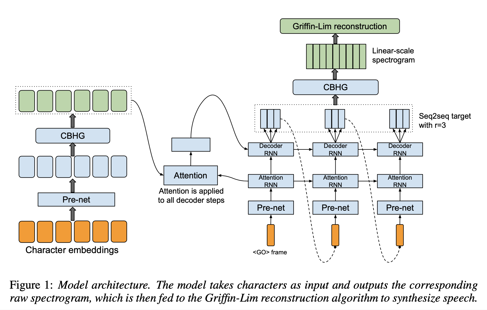
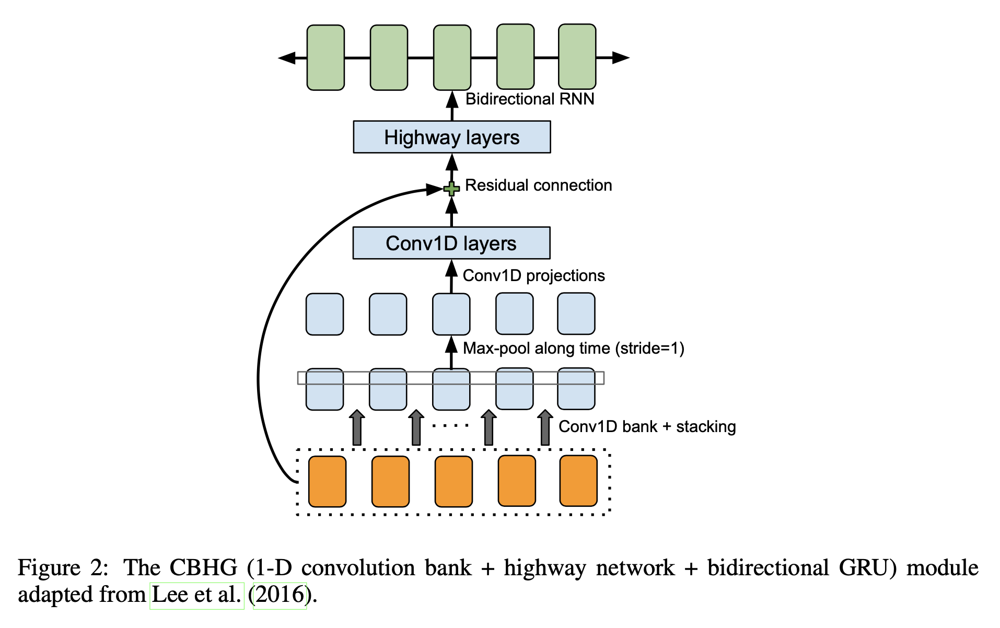
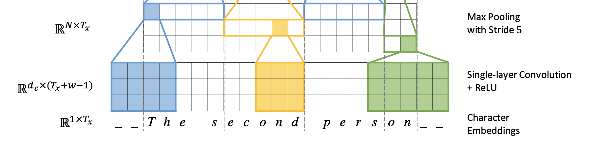
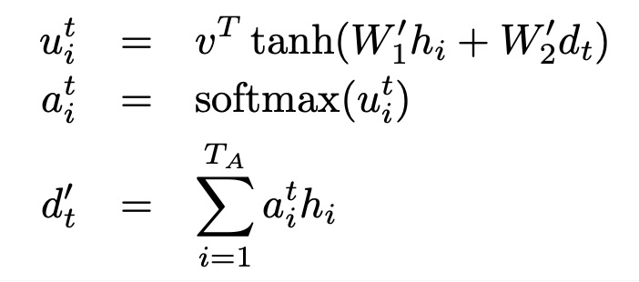

# Tacotron: Towards End-to-end Speech Synthesis (2017), Y. Wang et al.

###### contributors: [@GitYCC](https://github.com/GitYCC)

\[[paper](https://arxiv.org/pdf/1703.10135.pdf)\] 

---

### Introduction

- End-to-End TTS system
  - Tacotron alleviates the need for laborious feature engineering
  - Tacotron more easily allows for rich conditioning on various attributes, such as speaker or language, or high-level features like sentiment.
  - A single model is likely to be more robust than a multi-stage model where each component’s errors can compound.
- Our model takes characters as input and outputs raw spectrogram, using several techniques to improve the capability of a vanilla seq2seq model.
- Given <text, audio> pairs, Tacotron can be trained completely from scratch with random initialization. It does not require phoneme-level alignment, so it can easily scale to using large amounts of acoustic data with transcripts.


### Related Work

- WaveNet 
- DeepVoice
- First step towards end-to-end parametric TTS synthesis: Generating spectral parameters with neural attention (2016), W. Wang et al.
- Char2Wav


### Model Architecture



- CBHG Module
  - 
  - Conv1D bank + stacking
    - The input sequence is first convolved with K sets of 1-D convolutional filters, where the k-th set contains $C_k$ filters of width $k$ (i.e. k = 1, 2, . . . , K ). These filters explicitly model local and contextual information (akin to modeling unigrams, bigrams, up to K-grams).
    - from: [Fully Character-Level Neural Machine Translation without Explicit Segmentation](https://arxiv.org/abs/1610.03017)
      
    - hyper-parameters:
      - encoder: K=16, conv-k-128-ReLU
      - post-processing net: K=8, conv-k-128-ReLU
  - Max-pool along time (stride=1)
    - The convolution outputs are stacked together and further max pooled along time to increase local invariances. Note that we use a stride of 1 to preserve the original time resolution.
    - hyper-parameters:
      - encoder: stride=1, width=2
      - post-processing net: stride=1, width=2
  - Conv1D projections
    - We further pass the processed sequence to a few fixed-width 1-D convolutions, whose outputs are added with the original input sequence via residual connections
    - hyper-parameters:
      - encoder: conv-3-128-ReLU → conv-3-128-Linear
      - post-processing net: conv-3-256-ReLU → conv-3-80-Linear
  - Highway layers
    - The convolution outputs are fed into a multi-layer highway network to extract high-level features.
    - hyper-parameters:
      - encoder: 4 layers of FC-128-ReLU
      - post-processing net: 4 layers of FC-128-ReLU
  - Bidirectional RNN
    - hyper-parameters:
      - encoder: 128 GRU cells
      - post-processing net: 128 GRU cells
- Pre-net
  - apply a set of non-linear transformations to each embedding: a bottleneck layer with dropout
  - hyper-parameters:
    - encoder pre-net: FC-256-ReLU → Dropout(0.5) → FC-128-ReLU → Dropout(0.5)
    - decoder pre-net: FC-256-ReLU → Dropout(0.5)→ FC-128-ReLU → Dropout(0.5)

- Encoder

  - Character embeddings
    - hyper-parameters: 256-D
  - Encoder pre-net
  - Encoder CBHG: A CBHG module transforms the pre- net outputs into the final encoder representation used by the attention module.

- Decoder

  - Decoder pre-net

  - Attention RNN + Attention + Decoder RNN

    - Attention RNN: 
      - hyper-parameters: 1-layer GRU (256 cells)
    - Attention: content-based tanh attention
      - from: [Grammar as a Foreign Language](https://arxiv.org/pdf/1412.7449.pdf)
        
      - The vector $v$ and matrices $W_1′$ , $W_2′$ are learnable parameters of the model
      - $h_i$ : the encoder hidden states
      - $d_t$ : the hidden states of the decoder from "Attention RNN" outputs
    - Decoder RNN
      - hyper-parameters: 2-layer residual GRU (256 cells)
      - predicting $r$ frames at once: emitting one frame at a time forces the model to attend to the same input token for multiple timesteps; emitting multiple frames allows the attention to move forward early in training.
        - In inference, at decoder step t, the last frame of the r predictions is fed as input to the decoder at step t + 1.
      - The first decoder step is conditioned on an all-zero frame, which represents a `<GO>` frame.

  - post-processing CBHG

  - Griffin-Lim reconstruction

    - simple code:
      ```python
      def GLA(S, n_iter = 100, n_fft = 2048, hop_length = None, window = 'hann'):
        hop_length = n_fft//4 if hop_length is None else hop_length
        phase = np.exp(2j*np.pi*np.random.rand(*S.shape))
        for i in range(n_iter):
          xi = np.abs(S).astype(np.complex)*phase
          signal = librosa.istft(xi, hop_length = hop_length, window = window)
          next_xi = librosa.stft(signal, n_fft = n_fft, hop_length = hop_length, window = window)
          phase = np.exp(1j*np.angle(next_xi))
        xi = np.abs(S).astype(np.complex)*phase
        signal = librosa.istft(xi, hop_length = hop_length, window = window)
        return signal
      ```

    

