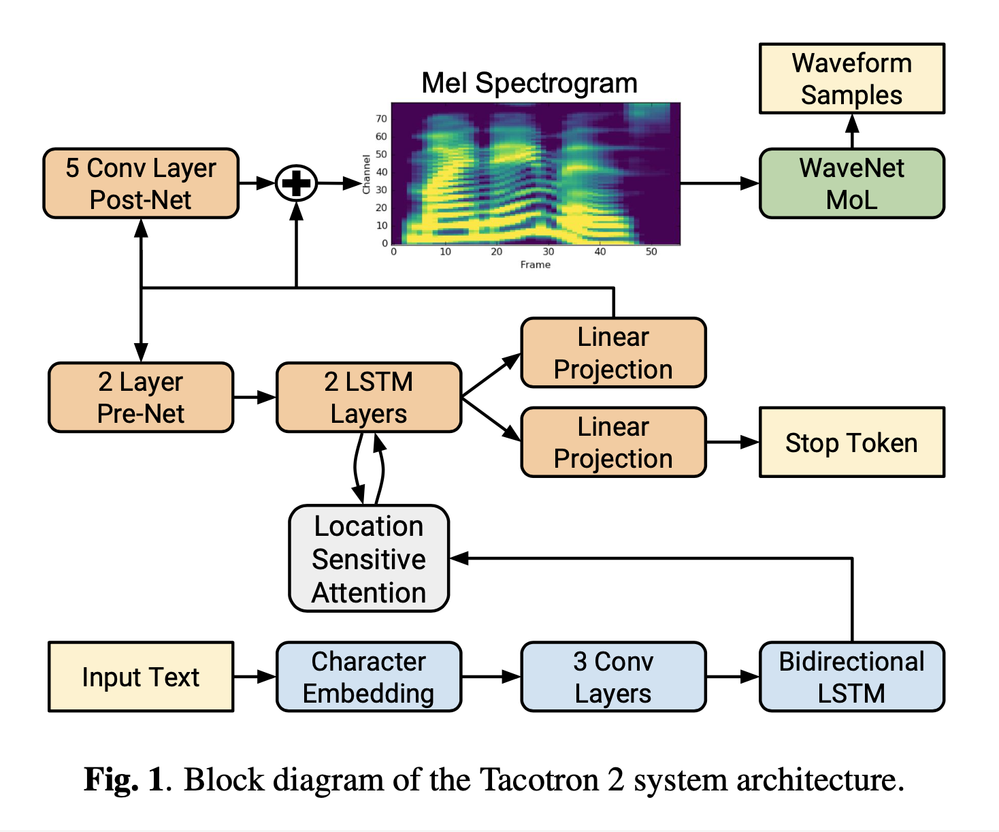
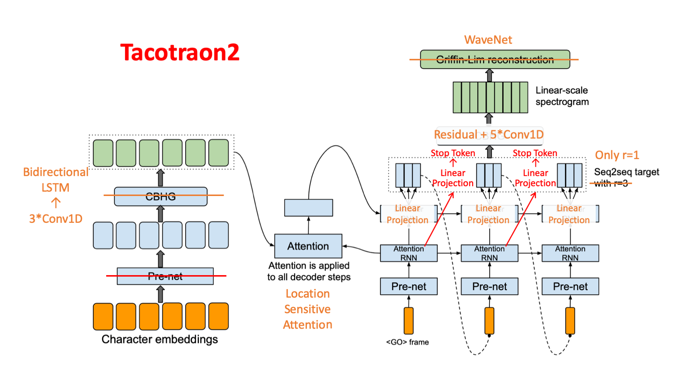
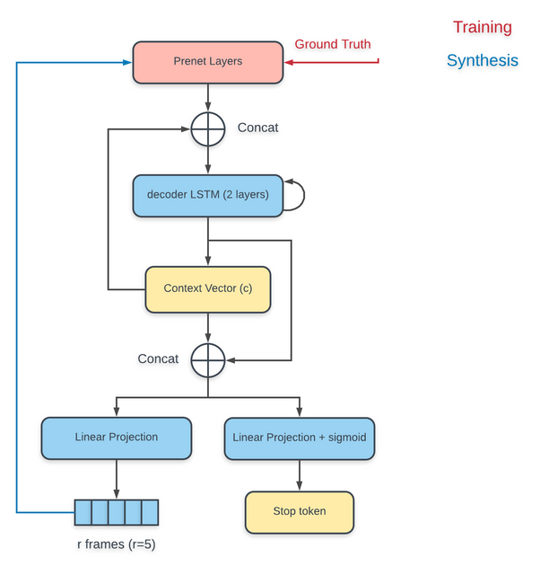
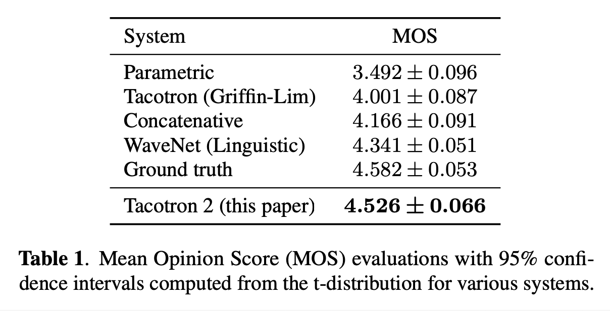
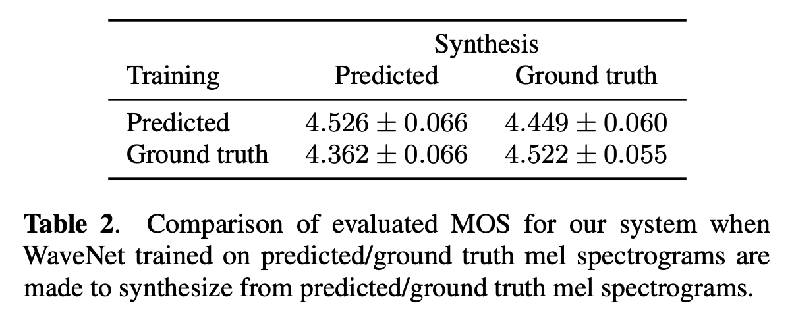

# Natural TTS Synthesis by Conditioning WaveNet On Mel Spectrogram Predictions (2018), J. Shen et al.

###### contributors: [@GitYCC](https://github.com/GitYCC)

\[[paper](https://arxiv.org/pdf/1712.05884)\] [[tensorflow](https://github.com/Rayhane-mamah/Tacotron-2)]

---

### Model Architecture

- Our proposed system consists of two components:
  1. a recurrent sequence-to-sequence feature prediction network with attention which predicts a sequence of mel spectrogram frames from an input character sequence
  2. a modified version of WaveNet which generates time-domain waveform samples conditioned on the predicted mel spectrogram frames

(original architecture depiction)

(my architecture depiction)

- Encoder

  - Character embeddings: learned character embedding,
    - hyper-parameters: 256-D
  - 3\*Conv1D:  As in Tacotron, these convolutional layers model longer-term context (e.g., N-grams) in the input character sequence.
    - hyper-parameters: \[Conv1D-5-512 → BN → ReLU → Dropout(0.5)\]\*3
  - Bidirectional LSTM
    - hyper-parameters: 512 units (256 in each direction)

- Decoder

  - (from: https://github.com/Rayhane-mamah/Tacotron-2/wiki/Spectrogram-Feature-prediction-network)
    

  - Pre-net: apply a set of non-linear transformations to each embedding: a bottleneck layer with dropout

    - hyper-parameters: decoder pre-net: FC-256-ReLU → Dropout(0.5)→ FC-256-ReLU → Dropout(0.5)
    - In order to introduce output variation at **inference time, dropout with probability 0.5** is applied to layers in the pre-net of the autoregressive decoder.

  - The pre-net output and attention context vector are concatenated and passed through a stack of 2 uni-directional LSTM layers with 1024 units.

  - Context Vector

    - traditional seq2seq (from: https://github.com/tensorflow/nmt)
      

    - Attention: location-sensitive attention

      - It extends the additive attention mechanism to use cumulative attention weights from previous decoder time steps as an additional feature. This encourages the model to move forward consistently through the input, mitigating potential failure modes where some subsequences are repeated or ignored by the decoder.

      - (from: [Attention-Based Models for Speech Recognition](https://arxiv.org/pdf/1506.07503.pdf) and https://github.com/Rayhane-mamah/Tacotron-2/wiki/Spectrogram-Feature-prediction-network)
        To be location-aware (for encoder) by making it take into account the alignment produced at the previous step. First, we extract $k$ vectors $f_{i,j} \in R^k$ for every position $j$ of the previous cumulative alignment $cα_{i−1}$ by convolving it with a matrix $F \in R^{k×r}$:
        $$
        f_i=F\ *\ c\alpha_{i-1}\ \ \ (where:\ c\alpha_{i-1}=\sum_{j=1}^{i-1}\alpha_j)
        $$
        These additional vectors $f_{i,j}$ are then used by the scoring mechanism $e_{i,j}$ :
        $$
        e_{i,j} = w^T tanh(W s_{i} + V h_j + Uf_{i,j} + b)
        $$

        - The vector $w$, $b$ and matrices $W$, $V$, $U$ are learnable parameters of the model
        - $h_j$ : the encoder hidden states
        - $s_i$ : the hidden states of the decoder from "Attention RNN" outputs

  - The concatenation of the LSTM output and the attention context vector is projected through a linear transform to predict the target spectrogram frame.

  - Finally, the predicted mel spectrogram is passed through a 5-layer convolutional post-net which predicts a residual to add to the prediction to improve the overall reconstruction.

    - hyper-parameters of post-net layer: 512 filters with shape 5 × 1 with batch normalization, followed by tanh activations on all but the final layer
    - fixed $r=1$
    - The first decoder step is conditioned on an all-zero frame, which represents a `<GO>` frame.

  - In parallel to spectrogram frame prediction, the concatenation of decoder LSTM output and the attention context is projected down to a scalar and passed through a sigmoid activation to predict the probability that the output sequence has completed. This “stop token” prediction is used during inference to allow the model to dynamically determine when to terminate generation instead of always generating for a fixed duration.

### Result

- Good: train WaveNet by predicted mel spectrograms