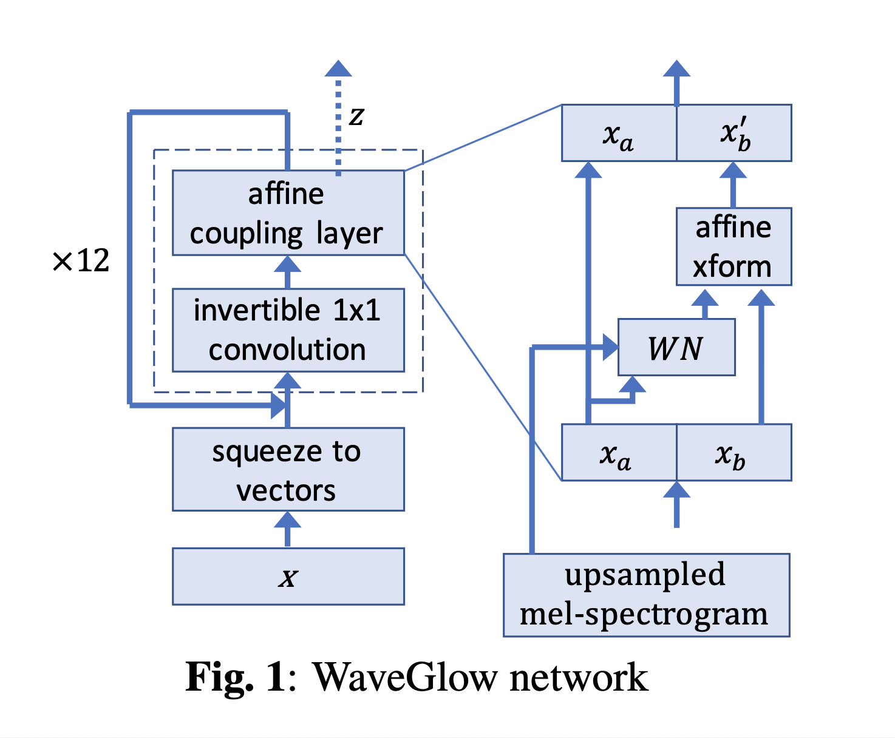
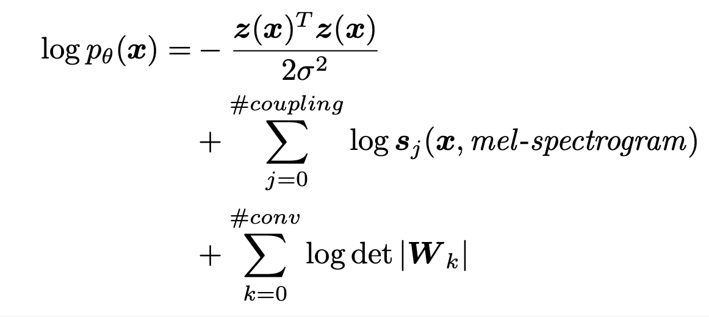
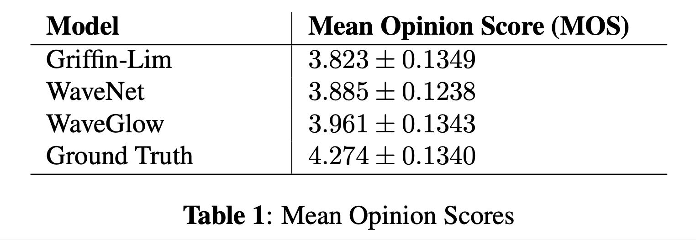

# WaveGlow: A Flow-based Generative Network for Speech Synthesis (2018), R. Prenger et al.

###### contributors: [@GitYCC](https://github.com/GitYCC)

\[[paper](https://arxiv.org/pdf/1811.00002)\] \[[pytorch](https://github.com/NVIDIA/waveglow)\]

---

## Introduction

- In this paper we propose WaveGlow: a flow-based network capable of generating high quality speech from mel-spectrograms.
  - Text-to-speech synthesis is typically done in two steps:
    1. transforms the text into time-aligned features, such as a mel-spectrogram, or F0 frequencies and other linguistic features
    2. transforms these time-aligned features into audio samples, called vocoder (we focus on this!)
- WaveGlow = [Glow](../generative/glow.md) + [WaveNet](./wavenet.md)
- WaveGlow is implemented using only a single network, trained using only a single cost function: maximizing the likelihood of the training data, which makes the training procedure simple and stable.
- problem of auto-regressive models: can’t fully utilize parallel processors like GPUs or TPUs
  - 3 neural network based models that can synthesize speech without auto-regression: 
    - Parallel WaveNet
    - Clarinet
    - MCNN
  - However, these 3 models are more difficult to train and implement than the auto-regressive models. All three require compound loss functions to improve audio quality or problems with mode collapse.

## WaveGlow



- $X$: audio sample

- $Z$: latent space

  - assume spherical Gaussian: $z\sim Gaussian(Z;0,I)$

  - convert $x$ to $z$ by many invertible layers: $x=f_0\circ f_1\circ ...f_k(z)$ and $z=f_k\circ ...f_1\circ f_0(x)$

  - we can describe distribution between $p_\theta(x)$ and $p_\theta(z)$ by a change of variables:
    $$
    log\ p_\theta(x)=log\ p_\theta(z)+\sum_{i=1}^{k}log\ |det(J(f^{-1}_{i}(x)))|
    $$

  - inference time: once the network is trained, doing inference is simply a matter of randomly sampling $z$ values from a Gaussian and running them through the network.

- squeeze to vectors

  - we take groups of 8 audio samples as vectors, which we call the ”squeeze” operation

  - ```python
    # audio: (batch, time)
    n_group = 8
    audio = audio.unfold(1, n_group, n_group) \ # (batch, time//n_group, n_group)
                 .permute(0, 2, 1) # (batch, n_group=channel, time//n_group)
    ```

- invertible 1x1 convolution

  - In order to avoid keeping the same part after mulitple coupling layers, we need a generalized permutation operation => invertible 1x1 convolution
  - The $W$ weights of these convolutions are initialized to be orthonormal and hence invertible.

- affine coupling layer
  $$
  x_a,x_b=split(x)
  $$

  $$
  (log\ s,t)=WN(x_a,mel\_spectrogram)
  $$

  $$
  x_{b'}=s\odot x_b + t
  $$

  $$
  f_{coupling}^{-1}(x)=concat(x_a,x_{b'})
  $$

  - The $WN$ architecture is similar to WaveNet
    - $WN()$ uses layers of dilated convolutions with gated-tanh nonlinearities, as well as residual connections and skip connections
    - different from WaveNet: our convolutions have 3 taps and are not causal
  - The affine coupling layer is also where we include the mel-spectrogram in order to condition the generated result on the input. The upsampled mel-spectrograms are added before the gated-tanh nonlinearites of each layer as in WaveNet.

- early outputs

  - Rather than having all channels go through all the layers, we found it useful to output 2 of the channels to the loss function after every 4 coupling layers. After going through all the layers of the network, the final vectors are concatenated with all of the previously output channels to make the final $z$. Outputting some dimensions early makes it easier for the network to add information at multiple time scales, and helps gradients propagate to earlier layers, much like skip connections. 

- After adding all the terms from the coupling layers, the final likelihood becomes:
  

## Results

- audio quality comparison
  - 

- demo
  - https://nv-adlr.github.io/WaveGlow


