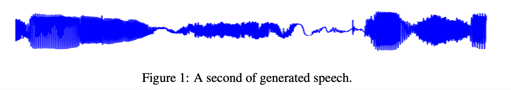
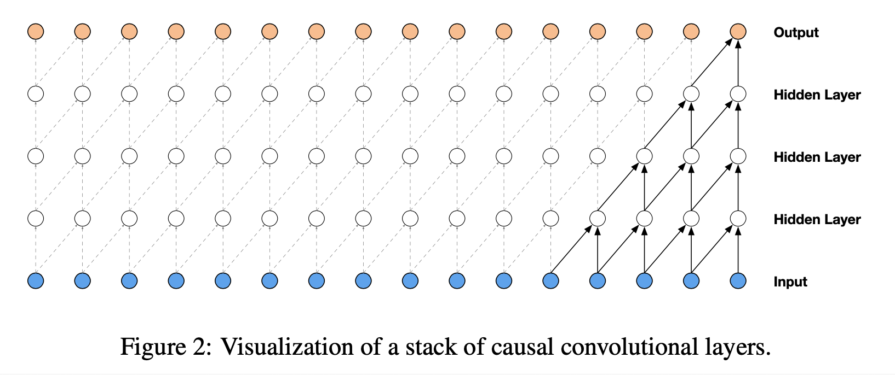
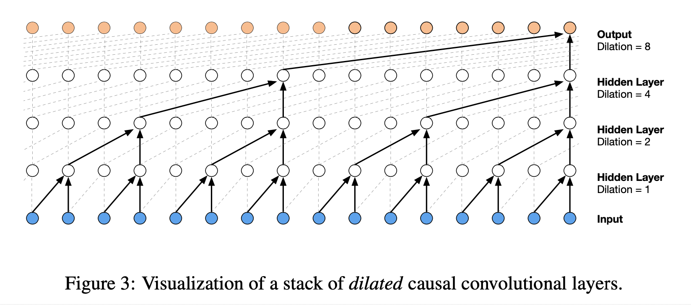
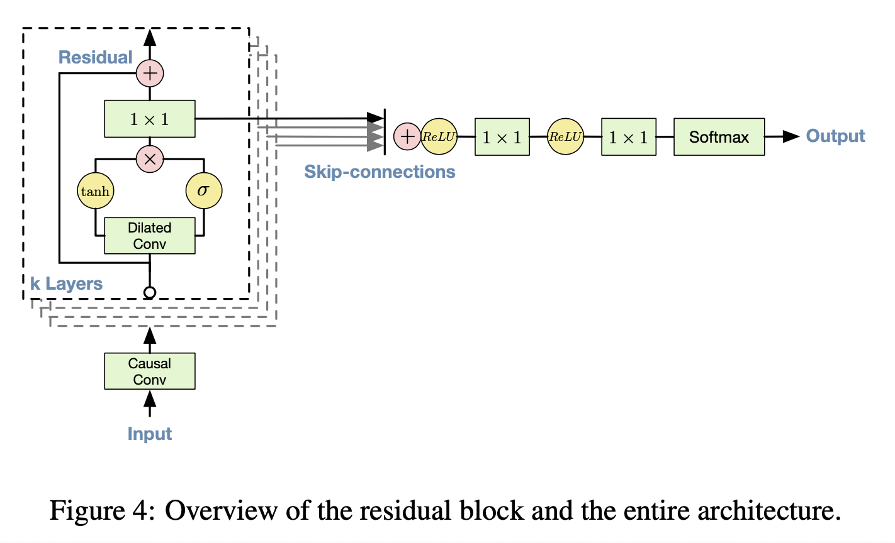
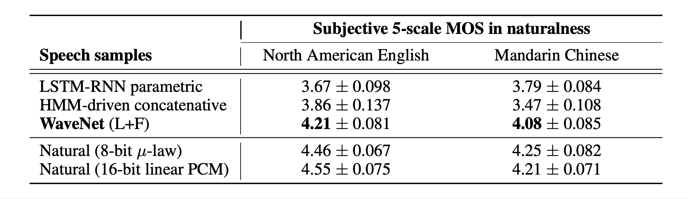

# WaveNet: A Generative Model For Raw Audio (2016), van den Oord, et al.

###### contributors: [@GitYCC](https://github.com/GitYCC)

\[[paper](https://arxiv.org/pdf/1609.03499.pdf)\] \[[tensorflow](https://github.com/ibab/tensorflow-wavenet)\] \[[tensorflow](https://github.com/buriburisuri/speech-to-text-wavenet)\]

---

**introduction**

- This paper introduces WaveNet, an audio generative model based on the PixelCNN (van den Oord et al., 2016) architecture.
- contributions:
  - We show that WaveNets can generate raw speech signals with subjective naturalness never before reported in the field of text-to-speech (TTS), as assessed by human raters.
  - large receptive fields: deal with long-range temporal dependencies
  - We show that when conditioned on a speaker identity, a single model can be used to generate different voices.
  - The same architecture shows strong results when tested on a small speech recognition dataset, and is promising when used to generate other audio modalities such as music.

**design**

- Waveform: our main input and output
  - 
  - we believe: $p(\bold{x})=\prod_{t=1}^{T}p(x_t\mid x_1,..,x_{t-1})$
    - where: $\bold{x}$ is the waveform; $x_1,..,x_{t-1}$ is the input; $x_t$ is the predicted output.
- Similarly to PixelCNNs, the conditional probability distribution is modelled by a stack of convolutional layers. There are no pooling layers in the network, and the output of the model has the same time dimensionality as the input. The model outputs a categorical distribution over the next value $x_t$ with a softmax layer and it is optimized to maximize the log-likelihood of the data w.r.t. the parameters.
- Causal Convolution
  - 
  - The equivalent of a causal convolution is a masked convolution which can be implemented by constructing a mask tensor and doing an elementwise multiplication of this mask with the convolution kernel before applying it.
  - Because models with causal convolutions do not have recurrent connections, they are typically faster to train than RNNs, especially when applied to very long sequences.
  - drawback: the receptive field is too small
- Dilated Causal Convolution
  - 
  - A dilated convolution is a convolution where the filter is applied over an area larger than its length by skipping input values with a certain step.
  - In this paper, the dilation is doubled for every layer up to a limit and then repeated: e.g. `1,2,4,...,512,1,2,4,...,512,1,2,4,...,512`
- Softmax Distributions
  - A softmax distribution tends to work better than mixture models such as a mixture density network (Bishop, 1994) or mixture of conditional Gaussian scale mixtures (MCGSM)
  - One of the reasons is that a categorical distribution is more flexible and can more easily model arbitrary distributions because it makes no assumptions about their shape.
  - But, $x_i$ in waveform stored as 16-bit integer values => output 65,536 probabilities => intractable
  - apply a μ-law companding transformation
    1. normalize 16-bit integer values to the range between -1 and 1
    2. apply a μ-law: $f(x_t)=sign(x_t)\frac{ln(1+\mu|x_t|)}{ln(1+\mu)}$ (where: $\mu=255$)
    3. quantize it to 256 possible values (8-bit integer) => tractable!
  - This non-linear quantization produces a significantly better reconstruction than a simple linear quantization scheme. Especially for speech, we found that the reconstructed signal after quantization sounded very similar to the original.
- Gate Activation Units
  - $\bold{z}=tanh(W_{f,k}*\bold{x})\odot \sigma(W_{g,k}*\bold{x})$
    - where: $k$ is the layer index; $f$ and $g$ denote filter and gate, respectively; $W$ is a learnable convolution filter
- Residual and Skip Connections
  - 
- Conditional WaveNets
  - By conditioning the model on other input variables, we can guide WaveNet’s generation to produce audio with the required characteristics.
  - global conditioning: characterised by a single latent representation h that influences the output distribution across all timesteps, e.g. a speaker identity embedding in a TTS model
    - $\bold{z}=tanh(W_{f,k}*\bold{x}+V_{f,k}^{T}\bold{h})\odot \sigma(W_{g,k}*\bold{x}+V_{g,k}^{T}\bold{h})$
  - local conditioning: we have a second timeseries $h_t$, e.g. linguistic features in a TTS model (possibly with a lower sampling frequency than the audio signal)
    - We first transform this time series using a transposed convolutional network (learned upsampling) that maps it to a new time series $y = f(h)$ with the same resolution as the audio signal
    - $\bold{z}=tanh(W_{f,k}*\bold{x}+V_{f,k}^{T}\bold{y})\odot \sigma(W_{g,k}*\bold{x}+V_{g,k}^{T}\bold{y})$

**results**

- Perfect Demo: https://www.deepmind.com/blog/wavenet-generative-model-raw-audio/
- Multi-speaker Speech Generation
  - free-form speech generation 
  - not conditioned on text, conditioned only on the speaker ID
  - The dataset consisted of 44 hours of data from 109 different speakers.
  - Because the model is not conditioned on text, it generates non-existent but human language-like words in a smooth way with realistic sounding intonations.
  - We observed that adding speakers resulted in better validation set performance compared to training solely on a single speaker. This suggests that WaveNet’s internal representation was shared among multiple speakers.
- Text-To-Speech
  - WaveNets for the TTS task were locally conditioned on linguistic features which were derived from input texts. => acheive TTS by the linguistic features
  - mean opinion score (MOS) tests: after listening to each stimulus, the subjects were asked to rate the naturalness of the stimulus in a five-point Likert scale score (1: Bad, 2: Poor, 3: Fair, 4: Good, 5: Excellent)
    - 

- Music
  - Of particular interest are conditional music models, which can generate music given a set of tags specifying e.g. genre or instruments. Similarly to conditional speech models, we insert biases that depend on a binary vector representation of the tags associated with each training clip. This makes it possible to control various aspects of the output of the model when sampling, by feeding in a binary vector that encodes the desired properties of the samples.
- Speech Recognition
  - Although WaveNet was designed as a generative model, it can straightforwardly be adapted to discriminative audio tasks such as speech recognition.