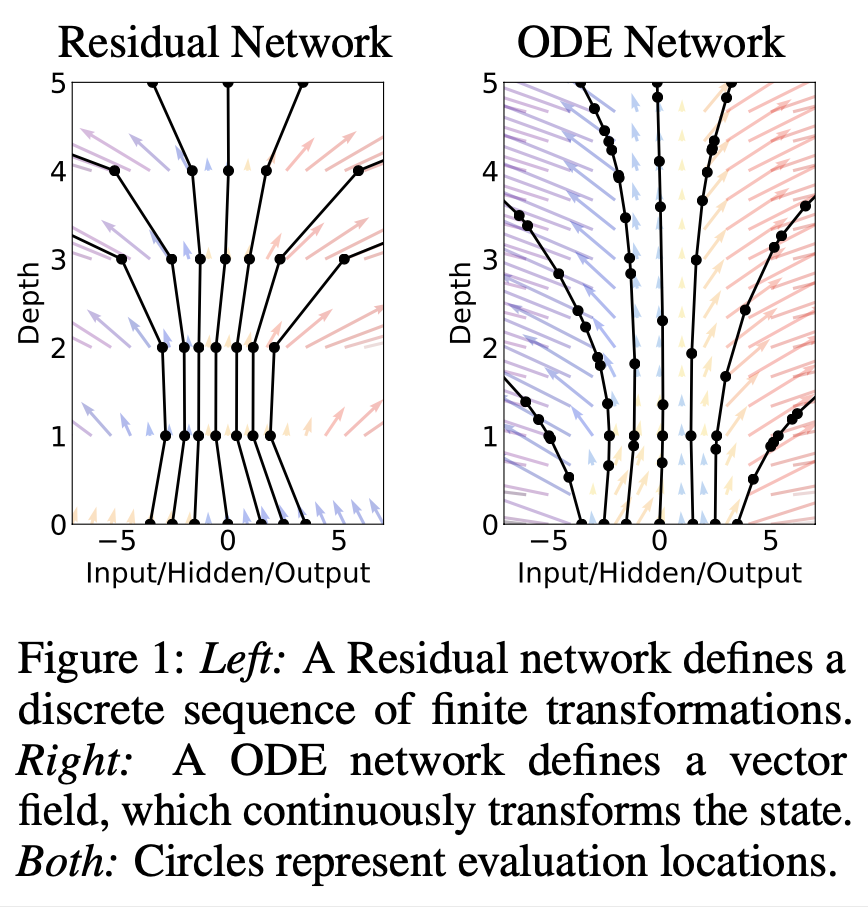
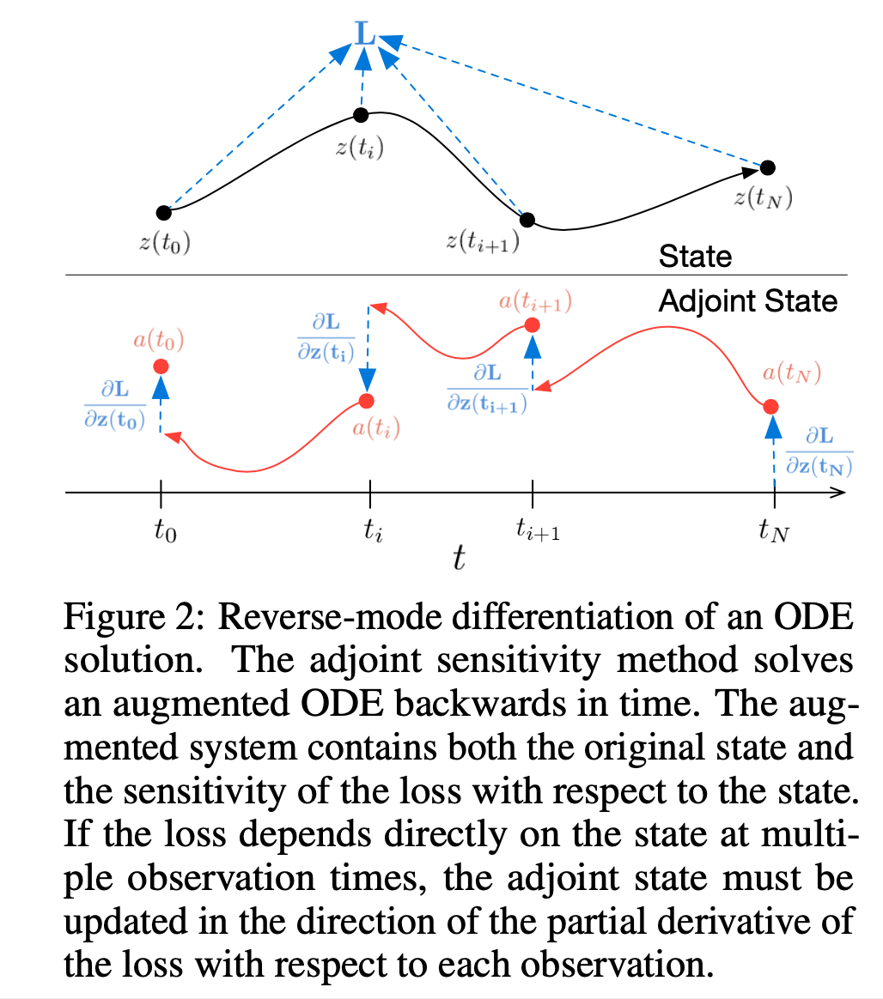
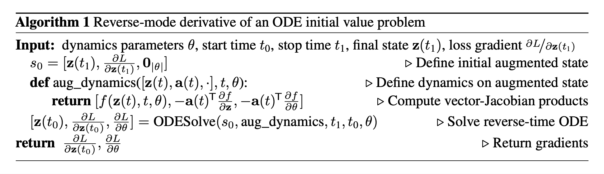
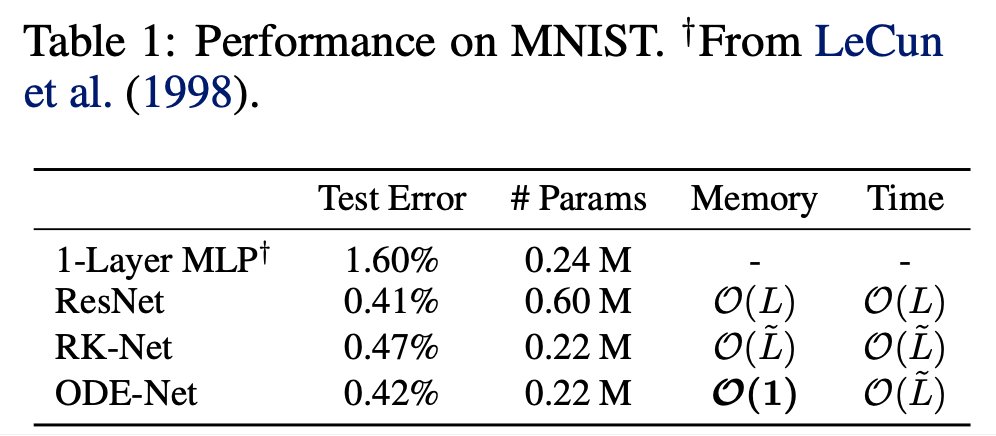
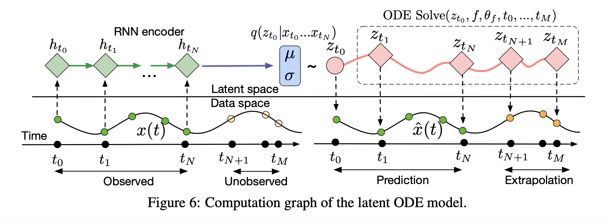
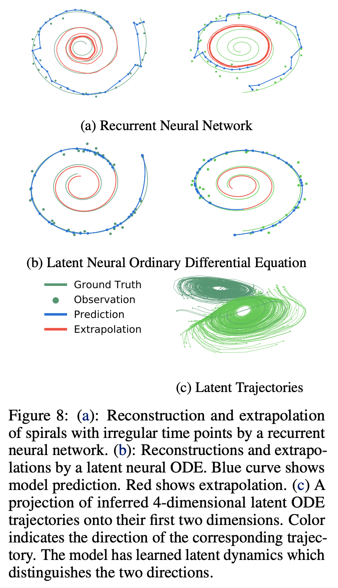

# Neural Ordinary Differential Equations (2019), Ricky T. Q. Chen et al.

###### contributors: [@GitYCC](https://github.com/GitYCC)

\[[paper](https://arxiv.org/pdf/1806.07366.pdf)\] \[[code](https://github.com/rtqichen/torchdiffeq)\]

---

### Abstract

- We introduce a new family of deep neural network models. Instead of specifying a discrete sequence of hidden layers, we parameterize the derivative of the hidden state using a neural network. The output of the network is computed using a black-box differential equation solver. These continuous-depth models have constant memory cost, adapt their evaluation strategy to each input, and can explicitly trade numerical precision for speed.

### Neural ODE

**Residual networks like steps of Eular method**

- Ordinary differential equation (ODE)

$$
\frac{d\bold{h}(t)}{dt}=f(\bold{h}(t),t,\theta)
$$

- Euler discretization:
  $$
  \bold{h}_{t+1}=\bold{h}_t+f(\bold{h}_t,\theta_t)
  $$

  - this is a residual layer

- Euler discretization method is not a good ODE solver.

- Could we have continuous-depth models instead of specifying a discrete sequence of hidden layers?

**Adjoint Sensitivity Method**

- $\bold{z}(t_0)=\bold{z}(t_1)+\int_{t_1}^{t_0}f(\bold{z}(t),t,\theta)dt$

  - we could use a black box ODE solver to solve above integral
    $$
    \bold{z}(t_0)=\text{ODESolve}(\bold{z}(t_1),f=f(\bold{z}(t),t,\theta),t_1,t_0,\theta)
    $$

- If loss $L(\bold{z}(t_1))$, $\frac{d\bold{z}(t)}{dt}=f(\bold{z}(t),t,\theta)$ and $\bold{a}(t)=\frac{dL}{d\bold{z}(t)}$, then 
  $$
  \bold{a}(t_0)=\bold{a}(t_1)-\int_{t_{1}}^{t_{0}}\bold{a}(t)^T\frac{\part f(\bold{z}(t),t,\theta)}{\part \bold{z}(t)}dt
  $$

  - we could use a black box ODE solver to solve above integral
    $$
    \bold{a}(t_0)=\text{ODESolve}(\bold{a}(t_1),f=-\bold{a}(t)^T\frac{\part f(\bold{z}(t),t,\theta)}{\part \bold{z}(t)},t_1,t_0,\theta)
    $$

- Computing the gradients with respect to the parameters $θ$ requires evaluating a third integral, which depends on both $\bold{z}(t)$ and $\bold{a}(t)$:
  $$
  \frac{dL}{d\theta}=-\int_{t_1}^{t_0}\bold{a}(t)^T\frac{\part f(\bold{z}(t),t,\theta)}{\part \theta(t)}dt
  $$

  - we could use a black box ODE solver to solve above integral
    $$
    \frac{dL}{d\theta}=\text{ODESolve}(\bold{0}_{|\theta|},f=-\bold{a}(t)^T\frac{\part f(\bold{z}(t),t,\theta)}{\part \theta},t_1,t_0,\theta)
    $$

### Replacing residual networks with ODEs for supervised learning

### A generative latent function time-series model

- We can train this latent-variable model as a variational autoencoder, with sequence-valued observations. Our recognition net is an RNN, which consumes the data sequentially backwards in time, and outputs $q_φ(z_0|x_1, x_2, . . . , x_N)$.

