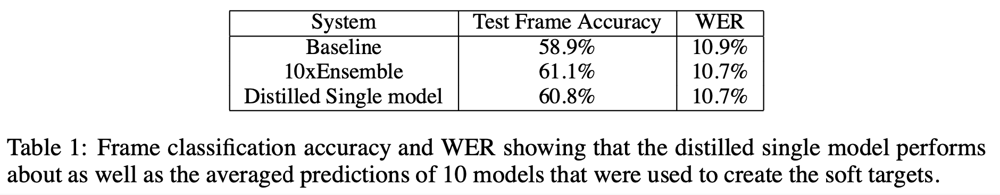

# Distilling the knowledge in a neural network \(2015\), G. Hinton et al.

\[[paper](http://arxiv.org/pdf/1503.02531)\] 

* latency and computational resources are very important in deployment stage
* cumbersome model
  * ensemble of separately trained models
  * large model with strong regularization \(such as dropout\)
* Once the cumbersome model has been trained, we can then use a different kind of training, which we call "distillation" to transfer the knowledge from the cumbersome model to a small model that is more suitable for deployment.
  * teacher model and student model
* hard targets: one-hot-encoding from groud true labels
* soft targets: use the class probabilities produced by the cumbersome model to train the distilled model
  * is arithmetic or geometric mean of their individual predictive distribution for the ensemble model
  * larger entropy -&gt; more information than hard targets
  * training: need less data and high learning rate \(v.s. hard targets\)
* soft targets have more information between classes than hard targets
  * e.g. soft targets shows BMW is more similar to garbage truck than carrot
  * e.g. in MNIST, soft targets provide the information that "1" is similar to "7"
  * e.g. you could randomly remove one class in MNIST. it still works
* use temperature to increase entropy of soft targets
  * softmax:

    $$
    q_i=exp\{z_i\}/\sum_j exp\{z_j\}
    $$

  * softmax with temperature

    $$
    q_i=exp\{z_i/T\}/\sum_j exp\{z_j/T\}
    $$
* method
  * Pretrained cumbersome model
  * Train distilled model
    * model with temperature
      * use same high temperature in training
      * use $$T=1$$ in deployment
    * use real data to support training distilled model: 

      weighted average of two different object function

      * $$C_1$$ from trained cumbersome model in high temperature
      * $$C_2$$ from real labels with normal cross entropy
      * "smaller weight of object\_function\_2" is better
      * $$loss=C_1T^2+\alpha C_2$$  \(why $$T^2$$ ? explain later\)

    * $$C_2=\sum_i (-y_iln(q_i)-(1-y_i)ln(1-q_i))$$ 

      * gradient: 

             $$\frac{\partial C_2}{\partial z_i}=\frac{1}{T}(q_i-y_i)$$ 

    * $$C_1=\sum_i (-p_iln(q_i)-(1-p_i)ln(1-q_i))$$ 
      * $$p_i=exp\{v_i\}/\sum_j exp\{v_j\}$$ from cumbersome model
      * $$\frac{\partial C_1}{\partial z_i}=\frac{1}{T}(q_i-p_i)$$ 
      * considering high temperature and zero-meaned sperately: $$\frac{\partial C_1}{\partial z_i}=\frac{1}{NT^2}(z_i-v_i)$$ 
      * equivalent: $$C_1\approx \frac{1}{NT^2}\sum\frac{1}{2}(z_i-v_i)^2$$ 
    * $$C_1T^2$$ ensures that the relative contributions of the hard and soft targets remain roughly unchanged if the temperature used for distillation is changed while experimenting with meta-parameters
* Experiments on speech recognition: 
  * DNN acoustic models with total number of parameters about 85M. Directly train the model as _baseline_, 10x ensemble with randomly initialized with different initial parameter values as _cumbersome model_, distill from cumbersome model as _distilled single model_
  * For the distillation we tried temperatures of 1,2,5,10 and used a relative weight of 0.5 on the cross-entropy for the hard targets.
  * evaluation: frame accuaracy \(sample frames with time-box\) and word error rate \(WER\)

* soft targets as regularizers
  * One of our main claims about using soft targets instead of hard targets is that a lot of helpful infor- mation can be carried in soft targets that could not possibly be encoded with a single hard target.

