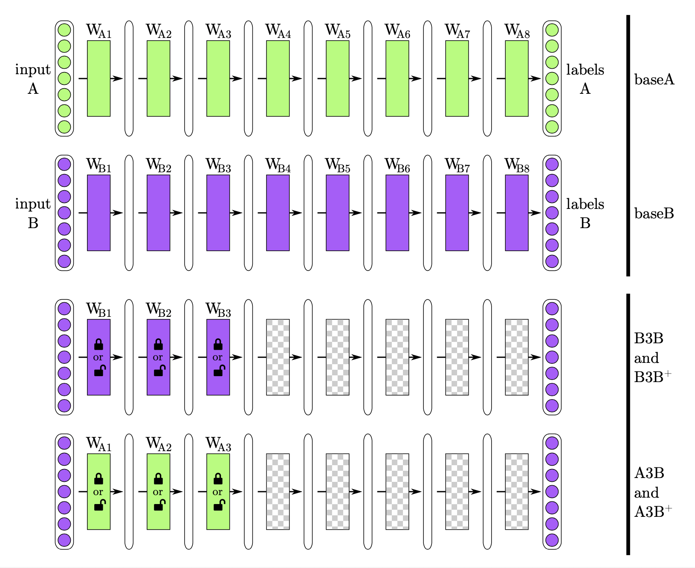
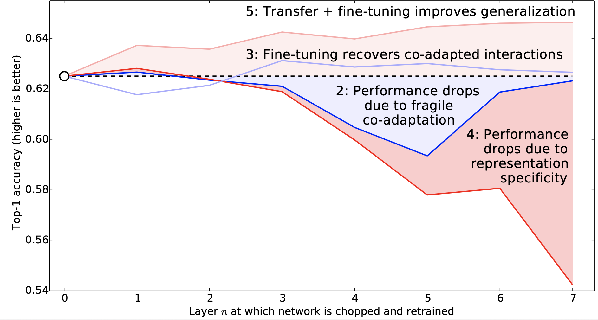
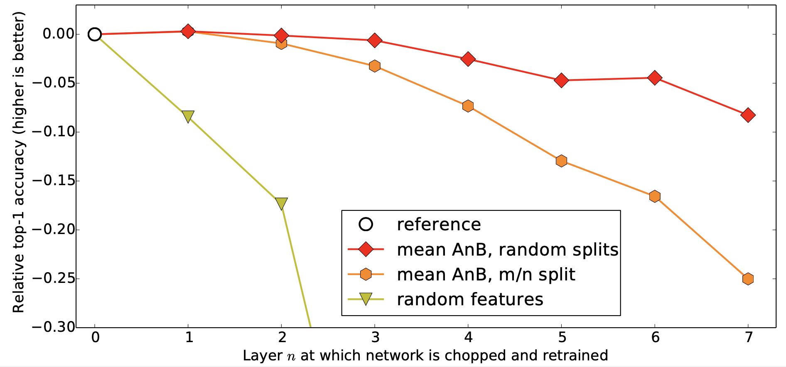

# How transferable are features in deep neural networks? \(2014\), J. Yosinski et al.

###### contributors:  [@GitYCC](https://github.com/GitYCC)

\[[paper](http://papers.nips.cc/paper/5347-how-transferable-are-features-in-deep-neural-networks.pdf)\]

---

**TR;DR**

- "transfer + fine-tuning" improves generalization
- freezing first few layers can slightly improve generalization
-  transferability is negatively affected by two distinct issues:
  - optimization difficulties related to splitting networks in the middle of fragilely co-adapted layers 
  - the specialization of higher layer features to the original task at the expense of (at the expense of sth. = result in the loss of sth.) performance on the target task.

**introduction**

- Modern deep neural networks exhibit a curious phenomenon: when trained on images, they all tend to learn first-layer features that resemble either Gabor filters or color blobs.
- Because finding these standard features on the first layer seems to occur regardless of the exact cost function and natural image dataset, we call these first-layer features general.
- On the other hand, we know that the features computed by the last layer of a trained network must depend greatly on the chosen dataset and task. We thus call the last-layer features specific.
- there must be a transition from general to specific somewhere in the network. This observation raises a few questions:
  - Can we quantify the degree to which a particular layer is general or specific?
  - Does the transition occur suddenly at a single layer, or is it spread out over several layers?
  - Where does this transition take place: near the first, middle, or last layer of the network?

- transfer learning
  - We first train a base network on a base dataset and task, and then we repurpose the learned features, or transfer them, to a second target network to be trained on a target dataset and task. This process will tend to work if the features are general, meaning suitable to both base and target tasks, instead of specific to the base task.
    - copy layers from base network to target network.  (How much layers should we copy?)
    - at training:
      - freeze copied layers?
      - fine-tune?
  - OLD: If the target dataset is small and the number of parameters is large, fine-tuning may result in overfitting, so the features are often left frozen.

**experimental design**

- dataset: 
  - source dataset is from the ImageNet with 1000 classes (including 551 man-made object classes and 449 natural classes)
  - Similar Datasets: just random splits from ImageNet
  - Dissimilar Datasets: splitting man-made and natural classes into separate datasets from ImageNet
- tasks: $A$ and $B$
  - $baseA$ and $baseB$ are the training tasks on two groups from dataset (similar datasets or dissimilar datasets)
  - A selffer network $BnB$: the first $n$ layers are copied from $baseB$ and frozen. ($n$=1,2,3,...,7) The other higher layers are initialized randomly and trained on dataset $B$. This network is a control for the next transfer network. 
  - A transfer network $AnB$: the first $n$ layers are copied from $baseA$ and frozen. The other higher layers are initialized randomly and trained toward dataset $B$. If $AnB$ performs as well as $baseB$, there is evidence that the frist $n$ layers are general, at least with respect to $B$. If performance suffers, there is evidence that the frist $n$ layers are specific to $A$.
  - A selffer network $BnB+$: just like $BnB$, but where all layers learn (fine-tune).
  - A transfer network $AnB+$: just like $AnB$, but where all layers learn (fine-tune). 

**results on similar datasets**

- legend
  - the white circles above n = 0 represent the accuracy of $baseB$.
  - dark blue line represents a $BnB$, marked number 2
  - dark red line represents a $AnB$, marked number 4
  - light blue line represents a $BnB+$, marked number 3
  - light red line represents a $AnB+$, marked number 5
- results
  - 2: Performance drops due to fragile co-adaptation
    - This performance drop is evidence that the original network contained fragile co-adapted features on successive layers, that is, features that interact with each other in a complex or fragile way such that this co-adaptation could not be relearned by the upper layers alone. Gradient descent was able to find a good solution the first time, but this was only possible because the layers were jointly trained.
    - As we get closer and closer to the final, 500-way softmax output layer 8, there is less to relearn, and apparently relearning these one or two layers is simple enough for gradient descent to find a good solution.
  - 3: Fine-tuning recovers co-adapted interactions
  - 4: Performance drops due to representation specificity
    - Layers 1 and 2 transfer almost perfectly from $A$ to $B$, giving evidence that, at least for these two tasks, not only are the first-layer Gabor and color blob features general, but the second layer features are general as well.
    - Thanks to the $BnB$ line, we can tell that this drop is from a combination of two separate effects:
      - optimization difficulties related to splitting networks in the middle of fragilely co-adapted layers 
      - the specialization of higher layer features to the original task at the expense of (at the expense of sth. = result in the loss of sth.) performance on the target task.
  - 5: Transfer + fine-tuning improves generalization
    - That transferring features and then fine-tuning them results in networks that generalize better than those trained directly on the target dataset. Previously, the reason one might want to transfer learned features is to enable training without overfitting on small target datasets, but this new result suggests that transferring features will boost generalization performance even if the target dataset is large. 
    - Even after 450k iterations of fine-tuning, the effects of having seen the base dataset still linger, boosting generalization performance.

**results on dissimilar datasets**

- legend
  - m/n split means dissimilar datasets
- results
  - degradation when transferring between dissimilar tasks

