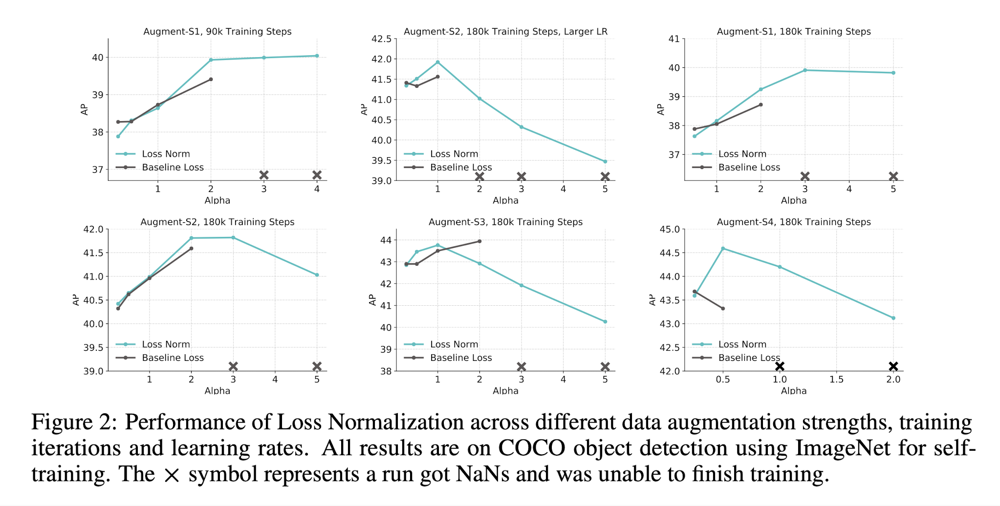
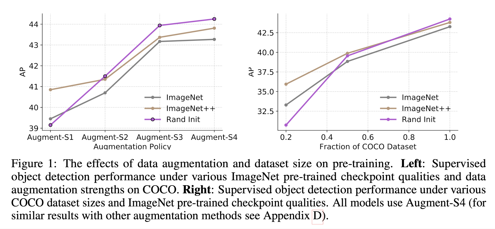
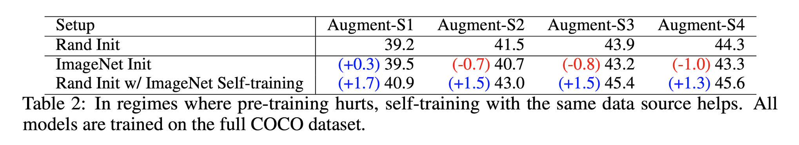
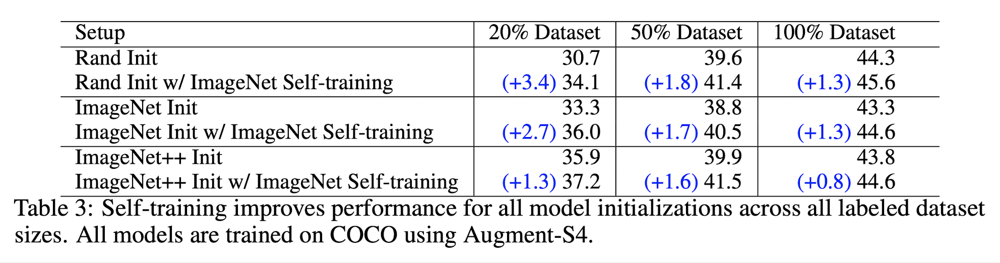
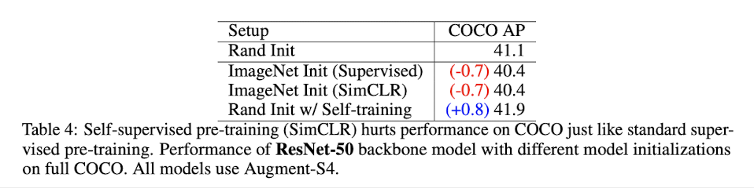
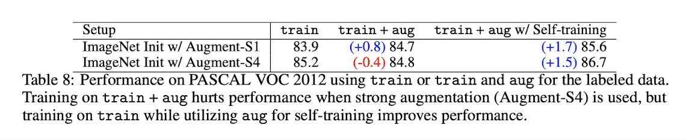

# Rethinking Pre-training and Self-training (2020), Barret Zoph et al.

###### contributors: [@GitYCC](https://github.com/GitYCC)

\[[paper](https://arxiv.org/pdf/2006.06882.pdf)\]

---

Our study reveals the generality and flexibility of self-training with three additional insights: 
- 1) stronger data augmentation and more labeled data further diminish the value of pre-training
- 2) unlike pre-training, self-training is always helpful when using stronger data augmentation, in both low-data and high-data regimes
- 3) in the case that pre-training is helpful, self-training improves upon pre-training

**Methodology**

- Data Augmentation
  - **Augment-S1**: Weakest augmentation: Flips and Crops
  - **Augment-S2**: Third strongest augmentation: AutoAugment, Flips and Crops
  - **Augment-S3**: Second strongest augmentation: Large Scale Jittering, AutoAugment, Flips and Crops
  - **Augment-S4**: Strongest augmentation: Large Scale Jittering, RandAugment, Flips and Crops
- Supervised Pre-training: using the EfficientNet-B7 architecture
  - **Rand Init**: Model initialized w/ random weights
  - **ImageNet Init**: Model initialized w/ ImageNet pre-trained checkpoint (84.5% top-1)
  - **ImageNet++ Init**: Model initialized w/ higher performing ImageNet pre-trained checkpoint (86.9% top-1)
- Self-supervised Pre-training: SimCLR
- Self-training: First, a teacher model is trained on the labeled data (e.g., COCO dataset). Then the teacher model generates pseudo labels on unlabeled data (e.g., ImageNet dataset). Finally, a student is trained to optimize the loss on human labels and pseudo labels jointly. 
  - the standard loss for self-training: $\hat{L}=L_h+\alpha L_p$  (where: $L_h$ and $L_p$ are human loss and pseudo loss)
    - But it is unstable (nan loss)
    - 
  - We thus implement a Loss Normalization method: $\hat{L}=\frac{1}{1+\alpha}(L_h+\alpha\frac{\bar{L_h}}{\bar{L_p}}L_p)$  (where: $\bar{L_h}$ and $\bar{L_p}$ are their respective moving averages over training)

**Experiments**

- The effects of augmentation and labeled dataset size on pre-training
  - 
  - observaions:
    - Supervised pre-training hurts performance when stronger data augmentation is used
    - More labeled data diminishes the value of supervised pre-training
- The effects of augmentation and labeled dataset size on self-training
  - 
  - observaions:
    - Self-training helps in high data/strong augmentation regimes, even when supervised pre-training hurts
  - 
  - observaions:
    - Self-training works across dataset sizes and is additive to supervised pre-training
- Self-supervised pre-training also hurts when self-training helps in high data/strong augmentation regimes
  - 

**Discussion**

- Rethinking pre-training and universal feature representations
- The importance of task alignment
  - One interesting result in our experiments is ImageNet pre-training, even with additional human labels, performs worse than self-training.
  - With strong data augmentation (Augment-S4), training with train+aug actually hurts accuracy, but pseudo labels generated by self-training on the same aug dataset significantly improves accuracy. 
    - 
  - **Above both results suggest that noisy (PASCAL) or un-targeted (ImageNet) labeling is worse than targeted pseudo labeling.**
- Limitations: self-training requires more compute than fine-tuning on a pre-trained model
- The scalability, generality and flexibility of self-training

